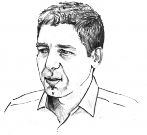

# Über mich

Ich bin Simon Dückert, geboren am 20.04.1974 in Schweinfurt. Ich bin dort ins [Walther-Rathenau Gymnasium](https://www.walther-rathenau-sw.de/) gegangen und habe dann Elektrotechnik an der [Friedrich-Alexander Universität Erlangen-Nürnberg](https://www.fau.de/) Elektrotechnik mit Schwerpunkt Digitale Nachrichtentechnik studiert. 2001 habe ich zusammen mit Michael Müller, Marc Holfelder und Herbert Stoyan die [Cogneon GmbH](https://cogneon.de/) in Nürnberg gegründet. Dort bin ich bis heute in Anlehnung and die [Akademie von Platon](https://de.wikipedia.org/wiki/Platonische_Akademie) als [Scholarch](https://de.wikipedia.org/wiki/Scholarch) tätig.

## Kontakt

- Email: simon@dueckert.eu ([PGP Public Key](https://cloud.dueckert.eu/s/P2fJ3662dinrCo4))
- Mastodon: [@sdueckert@chaos.social](https://chaos.social/@sdueckert)
- Matrix: [simondueckert:matrix.org](https://matrix.to/#/@simondueckert:matrix.org)
- Threema-ID: P7MCJVJ2
- Signal: [signal.me](https://signal.me/#eu/MGoIFTY_etOrPll34WPdGdHDrp7saBAaG2sjutl4_r30G71oRoRDnaXjnXYl0s_9)