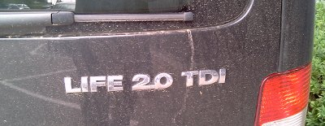

Auf dem Audi-Gelände bin ich am Freitag über ein Auto mit einer interessanten Beschriftung gestolpert: "Life 2.0", für mich eine Metapher für ein Leben, dass nach den eigenen Wünschen geführt und gestaltet ist und zusätzlich die Interessen aller anderen Menschen heute und in Zukunft berücksichtigt. Und nachdem wir uns am Übergang zur Wissensgesellschaft befinden, gehört dazu auch ein systematischer Ansatz des persönlichen Wissensmanagements.

Das erinnert mich daran, dass mir letztes Jahr auf dem [KnowledgeCamp](https://www.gfwm.de/knowledge-camp/) jemand ein gutes Paper zum Thema Wissensgesellschaft gegeben hat, das ich verlegt habe. Hoffentlich kommt er dieses Jahr wieder!
