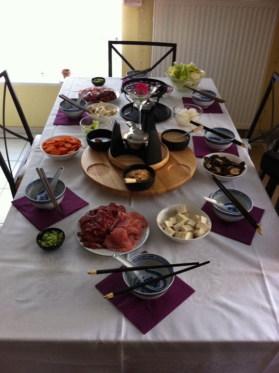

Für alle, die noch nicht wissen, was sie zu Sylvester kochen sollen ein kleiner Tipp: wer mal etwas anderes als Fondue oder Raclette machen möchte, dem empfehle ich [Shabu-Shabu](http://de.wikipedia.org/wiki/Shabu-Shabu), eine japanische Fondue-Variante. Besonders die Sesamsauce ist unvergesslich. Wer es wagen möchte, dem empfehle ich auf jeden Fall auch dicke [Udon-Nudeln](http://de.wikipedia.org/wiki/Udon) zu kaufen, um damit nachts die Brühe noch zu verspeisen.
