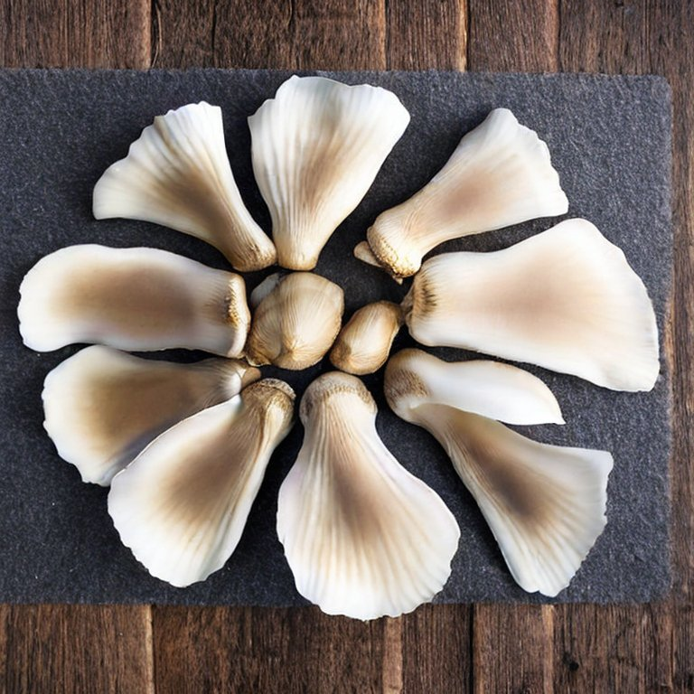

Unser Lieblingsrezept für Austernpilze ist das gleiche, wie für Parasol: panieren und braten! Aber ab und zu braucht man auch etwas Abwechslung.

<!-- more -->

**Zutaten:**

- 3-4 große Austernpilze grob zerrupft

- 1 Stange Lauch in daumendicken Scheiben

- 1 Chili entkernt und gehackt

- 1 Handvoll geschälte und grob gehackte Erdnüsse

- Öl

- 100 ml Gemüsebrühe

- 3 EL Balsamico

- Zucker

**Zubereitung:**

- Erdnüsse in Pfanne ohne Öl anrösten

- Lauchscheiben ca. 3 Minuten blanchieren und abtropfen lassen

- Pilze in sehr heissem Öl scharf anbraten

- Mit Brühe ablöschen und mit Salz, Pfeffer, Zucker würzen und einkochen lassen

- Lauch und Chili zugeben und erwärmen

- Mit Erdnüssen garnieren und mit Weißbrot oder Reis servieren
