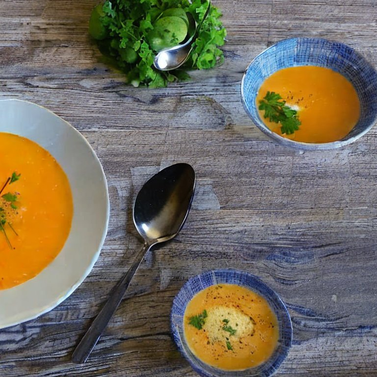

Herbstzeit ist Kürbiszeit. Zu einem Wissensmanagement-Strategie-Workshop habe ich mal wieder eine Kürbissuppe zubereitet. Nachdem mich eine Teilnehmerin schon letztes Jahr nach dem Rezept gefragt hat, will ich es den Teilnehmern nicht vorenthalten.

<!-- more -->

**Zutaten:**

- 1 Hokaido Kürbis
- 3 Äpfel
- 1 Stück Ingwer (ca. 3 cm)
- 1 Zwiebel
- Salz
- Pfeffer
- Fleisch- oder Gemüsebrühwürfel
- 4 TL Curry (alternativ [Ras el-Hanout](http://de.wikipedia.org/wiki/Ras_el-Hanout) für eine orientalische Note)
- Schmand
- Olivenöl

**Zubereitung:**

- Kürbis außen waschen. halbieren, Kerne entfernen und in Stücke schneiden
- Äpfel waschen, vierteln, Kerne entfernen und in Stücke schneiden
- Zwiebel würfeln
- Ingwer fein reiben
- Olivenöl in einem Topf erhitzen, dann Zwiebeln und Ingwer darin andünsten
- Kürbis- und Apfelstücke hinzugeben und unter rühren andünsten bis die Stücke anfangen weich zu werden
- Wasser angießen bis die Stücke knapp bedeckt sind und entsprechende Menge Brühwürfel hinzugeben
- Bei kleiner Hitze zugedeckt köcheln lassen
- Wenn die Stücke weich sind (ca. 10 Minuten) alles mit einem Pürrierstab fein pürrieren
- Mit Curry würzen sowie mit Salz und Pfeffer abschmecken
- Mit einer Haube Schmand servieren
- Dazu passt Weißbrot und ein trockener Weißwein
