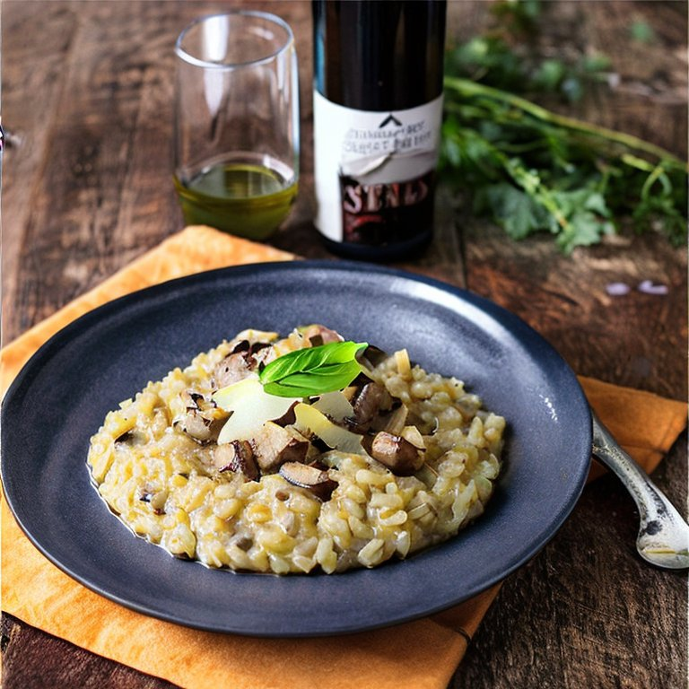

Heute haben wir in der Akademie besprochen, dass wie nächsten Herbst einen unserer Lernfreitage verwenden wollen, um Pilze suchen zu gehen. Hier schonmal eines meiner Lieblingsrezepte für Steinpilze.

<!-- more -->

**Zutaten:**

- 10 Steinpilze

- 1 Zwiebel

- 1 Knoblauchzehe

- 80 gr. Parmesan gerieben

- 750 ml Rinderfond

- 50 ml Weisswein

- 4 EL Butter

- 400 gr. Arborio-Reis

- Olivenöl

- Salz und Pfeffer

**Zubereitung:**

- Hälfte der Steinpilze in Stücke, Hälfte in Scheiben schneiden

- Zwiebel und Knoblauch würfeln

- Parmesan reiben

- Rinderfond mit Weisswein in Topf erhitzen

- In anderem Topf 2 EL Butter erhitzen, um Zwiebel und Knoblauch anzudünsten, Pilze und Reis hinzugeben und bei ständigem Rühren glasig dünsten

- Hitze reduzieren und 2 Schöpfer Fond-Wein-Brühe hinzugeben

- Einkochen lassen und immer wieder eine Kelle Brühe hinzugeben bis der Reis nach ca. 25 Minuten bissfest ist

- Risotto mit Salz und Pfeffer würzen, Parmesan (etwas zum Garnieren übrig lassen) und restliche Butter unterrühren

- Steinpilzscheiben in etwas Bitter braten und mit Salz und Pfeffer würzen

- Risotto mit gebratenen Steinpilzen garniert servieren
