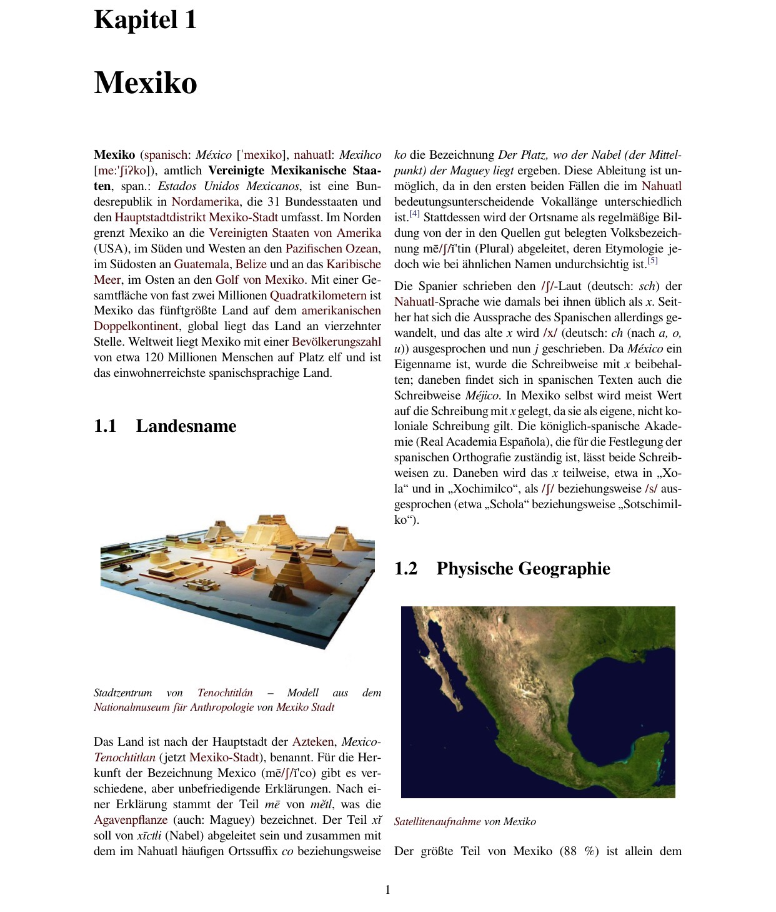

Habe mir gerade mit der [Buchfunktion der Wikipedia](https://de.m.wikipedia.org/wiki/Hilfe:Buchfunktion) einen 180-seitigen Reiseführer Mexiko kuratiert. Als Export erhält mein ein PDF-Dokument zum herunterladen, als Formatierung habe ich zweispaltig gewählt. Wenn man auf dem iPhone die App Goodreader verwendet, funktionieren sogar die Sprungmarken im PDF.

 
