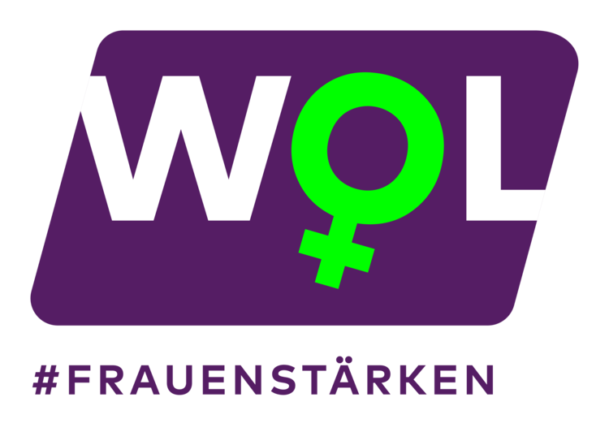

Am 07. Januar 2021 starte ich meinen **13\. Working Out Loud Circle** im Rahmen des WOL FrauenStärken Programms (das auch für Männer offen ist). Ich schreibe einige Erfahrungen zum Programm [in CONNECT](https://community.cogneon.de/t/wol-frauenstaerken-07-01-22-04-2020) zusammen und verwende [ein Pad](https://hackmd.io/fe3Et8E0TPGgDIVSA4Robw) für die Verfolgung meines Ziels.
