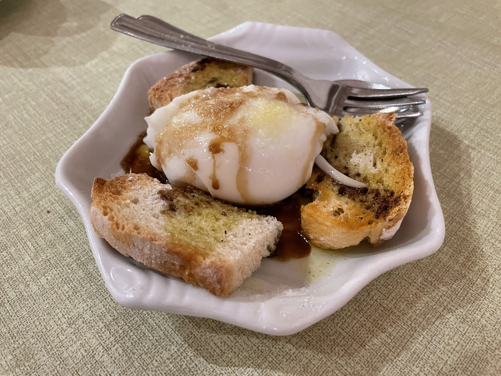

Im Urlaub 2021 in der Toskana im [Haus Il Palazzino](https://www.ilpalazzino.net/) zum Frühstück entdeckt:

<!-- more -->

Zutaten für 1 Person:

- 1 Ei
- Grobes Meersalz
- Olivenöl
- Balsamico
- Brotscheibe

Zubereitung:

1. Ei weich kochen
2. Brot im Toaster knusprig toasten
3. Ei schälen und längs einschneiden
4. Ei mit Brot auf kleinen Teller anrichten
5. Alles mit Meersalz bestreuen
6. Alles mit Olivenöl und Balsamico beträufeln
