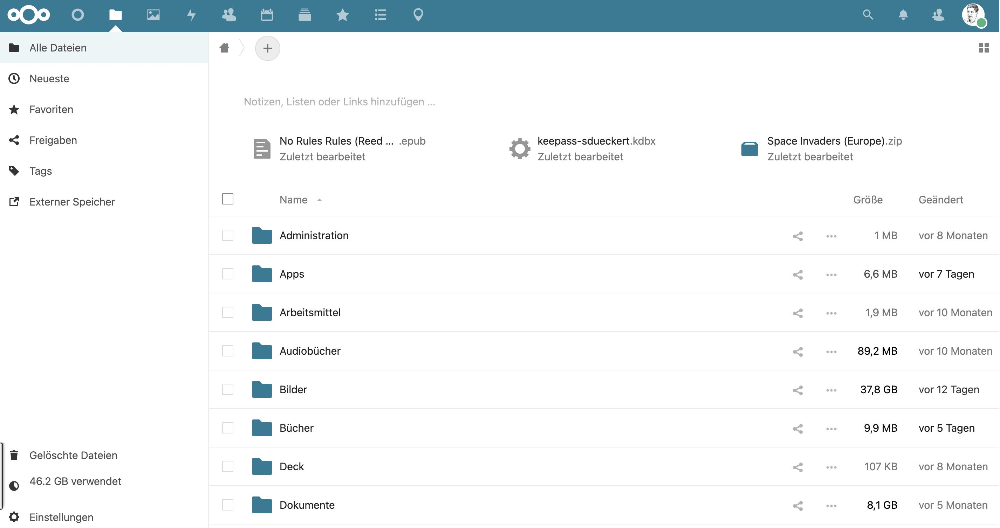
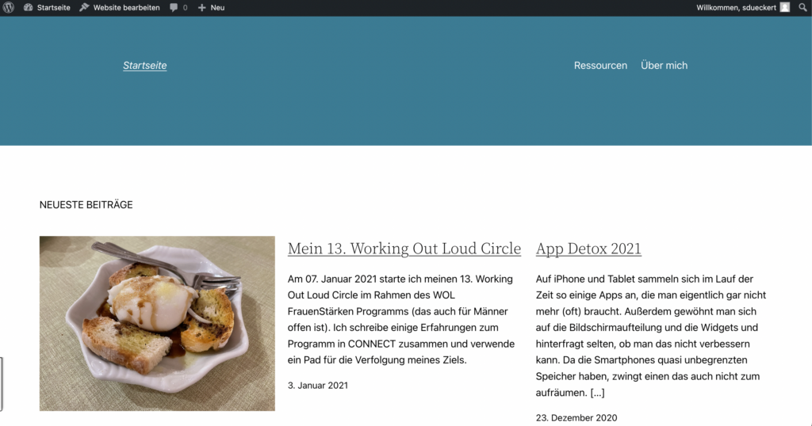
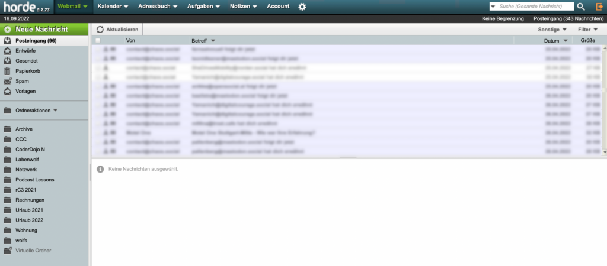

Heute habe ich einen Tweet mit der Idee geschrieben, dass Privatpersonen und Familien doch einen eigenen Server haben sollten, um sich von Diensten wie GMX, Web.de, Gmail, Dropbox & Co. unabhängig zu machen. Ich erlebe öfter, dass es da Berührungsängste gibt, weil viele denken, ein eigener Server ist nur was für Nerds. Klar, es ist vielleicht am Anfang ein bisschen mehr Aufwand, als sich einfach ein (vermeintlich) kostenfreies Konto bei einem (oft amerikanischen) Anbieter zu klicken.

<!-- more -->

Ich glaube aber, dass sich der kleine Mehraufwand lohnt, weil man wichtige 21st-Century-Skills erlernt und das Internet und seinen aufbau versteht. Außerdem ist der Aufwand mittlerweile tatsächlich auch sehr übersichtlich. Da mich einige nach einer kleinen Beschreibung gefragt haben, hier mal einige Stichpunkte, wie man an das Thema herangehen kann.

Ich fange mal damit an, meine eigenen Rahmenbedingungen, die zu einem (eigentlich zwei) eigenen Servern geführt haben:

1. In der engeren Familie haben alle **iPhones**, da läuft der **Chat** ausschließlich über iMessage. In der weiteren Familie und dem Bekanntenkreis sind auch **Androiden** dabei, da braucht es dann andere Lösunge (Whatsapp nutzen wir gar nicht).

3. **Email-Adressen** war ein Desaster, weil da alle "historisch gewachsene" Lösungen hatten (das hieß i.d.R. GMX, Web.de, t-online oder Gmail), dort waren dann auch meist Kontakte und ab und zu der eigene Kalender gespeichert.

5. **Ablage von Dateien** (inkl. Musik und Bilder) waren auch sehr unterschiedlich organisiert, oft kamen Dropbox oder Google Drive zum Einsatz.

7. Für Veröffentlichung von Inhalten im privaten Kontext braucht es dann noch eine **Website oder einen Blog**. Da ich mit [Wordpress](https://wordpress.org) am meisten Erfahrung habe, hatte ich den bei [Wordpress.com](https://wordpress.com) als Software as a Service.

In der Entwicklung gab es verschiedene Stufen. In der Pandemie habe ich z.B. damit angefangen, mit einer Nextcloud-Instanz auf unserem NAS ([Network Attached Storage](https://de.wikipedia.org/wiki/Network_Attached_Storage)), einer Synology Diskstation, zu experimentieren. Dafür musste man aber Menschen über unseren Router durch die Firewall lassen, es wurde unsere Upload-Kapazität genutzt und wenn das NAS mal nicht verfügbar war, gab es Beschwerden :-)

Im Winter 2021/2022 habe ich den Ansatz dann komplett in die Cloud verlagert und das ist der aktuelle Stand:

- **Hetzner Level 9 Hosting (ca. 110,- pro Jahr):** für den Wordpress Blog (100GB inklusive) und die E-Mail Boxen (300 IMAP Konten inklusive) ([Vergleich Level Pakete](https://www.hetzner.com/de/webhosting)). Entscheidend war für mich der Zugang per Secure Shell (SSH), die Anzahl der zusätzlich möglichen Domains (es gibt Menschen in der Familie mit anderen Nachnamen) und der Spam-Filter bei den Emails.

- **Hetzner NX 30 Storage Share (ca. 120,- pro Jahr):** das ist eine gehostete [Nextcloud](https://nextcloud.com/) Instanz. Man erhält 1TB Speicher bei 5TB Traffic (nichts für Video-/Musik-Streaming) und eine unbegrenzte Anzahl Nutzer\_innen (Vergleich Dropbox Familiy: € 17,- für 2TB und max. 6 Personen). Das Design anpassen und [Nextcloud Apps](https://apps.nextcloud.com/) (Erweiterungen, z.B. für Kalender, Kontakte, Bookmarks, Chat, Videokonferenz) installieren kann man selber, die Updates und das Backup übernimmt Hetzner ([Vergleich Pakete](https://www.hetzner.com/de/storage/storage-share?country=de)).

Zum Abschluss noch ein paar **Screenshots**, damit ihr euch ein Bild der Dienste machen könnt:

Screenshot der **Wordpress-Instanz** (diese Website), gerade umgestellt auf Wordpress 6 und das Twenty Twenty Two Blog-Theme (das braucht noch etwas Arbeit):

Screenshot des **Webmailers & Groupware von Hetzner** auf Basis von [Horde](https://www.horde.org/). Den benutze ich eigentlich nie, weil ich immer per IMAP auf die Mailbox zugreife (entweder über die Mail App auf iOS oder Mail-Anwendungen auf Windows bzw. Mac).

Startseite der **Nextcloud-Instanz**. Zusätzlich zum Standard installierte Addons: **Calender** (für den Sync mit Kalender Apps auf iOS und Mac über [CalDAV](https://de.wikipedia.org/wiki/CalDAV)), **Bookmarks** (Sync von Browser-Bookmarks, habe ich früher mit delicious gemacht, iOS App [nextBookmark](https://github.com/kitzler-walli/nextbookmark) und [Floccus](https://floccus.org/) Addon in Chrome), **Contacts** (Sync von Adressbüchern in Kontakte auf iOS und Mac), **Deck** (einfaches Kanban Board), **Forms** (Formulare für kleine Umfragen und Terminabstimmungen), **Theming** (um Logo und Farben der Oberfläche und der App anzupassen), **2-Factor-TOTP-Provider** (um Logins mit 2FA abzusichern, Authy als iOS App).

