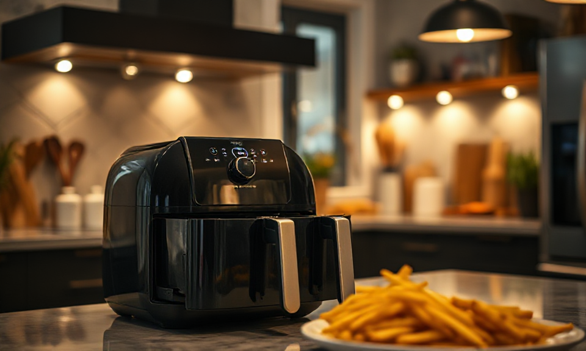

# Airfryer Blogparade

Letztes Jahr haben wir uns in der Familie einen Ahttps://amzn.to/4au8NFlirfryer Ninja Foodi Max Dual Zone AF400EU ([Anleitung](https://cloud.dueckert.eu/s/gD4b8eqDoYo2EyS), [Amazon Affiliate Link](https://amzn.to/4au8NFl)). So richtig viel haben wir seitdem aber noch nicht gemacht.

<!-- more -->

Wahrscheinlich war das häufigste Rezept **Pommes Frites** für Burger, gefolgt von aufgebackenen **Brötchen**, **Kichererbsen-Snack**, **Gemüse-Resteverwertung** und geschmolzenem **Camembert im Glas**. Ich habe mir zwar zwei Bücher mit Airfryer-Rezepten gekauft, aber die haben bisher noch nicht richtig verfangen.

Doch das will ich jetzt in den Ferien ändern. Ich starte dafür hier mal eine **Blog-Parade** und **Ihr könnt Eure Lieblingsrezepte in die Kommentare schreiben** oder als Antwort auf [Mastodon](https://de.wikipedia.org/wiki/Mastodon_(soziales_Netzwerk)) posten, gerne mit Link auf Rezept. Über die Zeit erstelle ich daraus eine kleine Kuration mit Rezepten.

Heute starte ich mit [Melanzane alla Parmigiana](https://en.wikipedia.org/wiki/Parmigiana) und **knusprigen Zwiebelringen**.