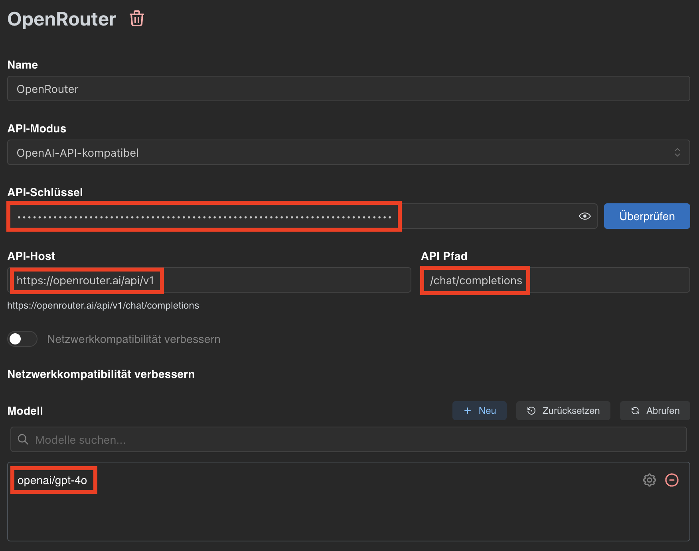

# Flexible KI mit niedrigem Preis

Wenn man wie ich beruflich mit [generativer KI](https://de.wikipedia.org/wiki/Generatives_KI-Modell) zu tun hat, bekommt man vom Arbeitgeber meist ein oder mehrere **KI-Tools** wie z.B. Microsoft Copilot, Github Copilot, ChatGPT, Claude oder interne Chatbots zur Verfügung gestellt. Wer KI-Tools privat nutzen möchte, scheut oft den Preis von **20-30 Euro pro Monat**.

Doch da gibt es eine ganz gute Alternative, die ich auch sehr viel nutze. Bei Firmen wie Microsoft, OpenAI und Anthropic kann man sich für eine **monatliche Gebühr** ein Abo für deren Webdienste kaufen. Alternativ bieten sie aber auch den Zugang zu ihren [Sprachmodellen](https://de.wikipedia.org/wiki/Large_Language_Model) über eine so genannte [API](https://de.wikipedia.org/wiki/Programmierschnittstelle) (Application Programming Interface).

<!-- more -->

Diesen API-Zugang kann man sich direkt bei Anbieter buchen, es gibt aber auch Dienste, die den Zugang zu ganz verschiedenen Sprachmodellen anbieten. Einer davon - den ich auch nutze - ist [openrouter.ai](https://openrouter.ai/). Da ist man dann nicht auf ein Sprachmodell festgelegt, Openrouter bietet aktuell [über 400 Modelle](https://openrouter.ai/models) an. **Die Abrechnung erfolgt nach Verbrauch** und nicht pauschal.

Die Einrichung ist eigentlich recht einfach:

1. Auf eurem Rechner müsst ihr ein **lokales KI-Tool** installieren, mit dem ihr auf die API eines Anbieters zugreifen könnt, ich verwende auf Mac und Windows [Chatbox](https://chatboxai.app/de).

2. Dann legt ihr euch z.B. bei [Openrouter](https://openrouter.ai/) ein Konto an. dort könnt ihr euch im Menü unter *Keys* einen **API-Key** erzeugen (der ist wie ein Passwort für den Zugriff, nicht weitergeben!)

3. Jetzt müsst ihr nur noch in **Chatbox** unter *Einstellungen > Modellanbieter > OpenRouter* den **API-Schlüssel** eintragen (Hinweis: unter **API-Host** müsst ihr "https://openrouter.ai/api/v1" und unter **API-Pfad** "/chat/completions" eintragen)

4. Dann einfach in der gleichen Einstellung auf <kbd>Abrufen</kbd> klicken und die **gewünschten Sprachmodelle** hinzufügen (Tipp: wer nach dem ganzen GPT-5-Debakel einfach sein geliebtes GPT-4o zurück haben will, kann einfach nur das auswählen).

5. Dann über <kbd>Neuer Chat</kbd> einen **neuen Chat starten** und unten rechts das gewünschte Sprachmodell auswählen.

6. Tipp: bei Openrouter findet ihr unter *Credits* euren aktuellen **"Kontostand"** und unter *Activity* die genaue Auflistung eures Verbrauchst, wie bei einem Kontoauszug.

