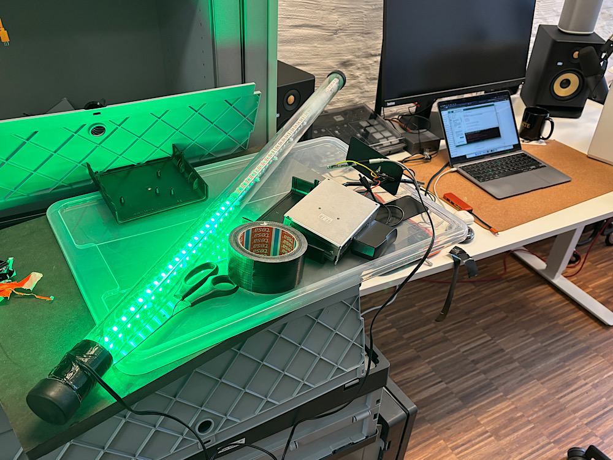

# LED Lightning Talk Lampe mit Vibe Coding



Ich hatte schon lange vor, mal eine leicht zu bedienende **LED-Lampe für Lightning Talks** zu bauen. Vor deer Pandemie hatte ich dazu schon 4x56 LED-Streifen in einem Acryl-Rohr verbaut und an einen Mikrocontroller angeschlossen. Jetzt habe ich die Gelegenheit gefunden, die Lampe endlich fertigzustellen.

<!-- more -->

Ich war bisher nicht dazu gekommen, eine anständige **Software für die Lampe** zu bauen, weil wir in und nach der Pandemie bis zur loscon24 virtuelle Countdowns mit OBS verwendet haben. Vor der [loscon25](https://wiki.cogneon.de/loscon25) war auch nicht viel Zeit und ich hatte eine behelfsmäßige Variante mit einer **8x32 LED-Matrix**, einem [ESP32](https://de.wikipedia.org/wiki/ESP32) und [WLED](https://kno.wled.ge) gebaut. Für ein anständiges Gehäuse hat es nicht mehr gereicht und die "Schrottigkeit" des Anblicks hat mich die ganze Zeit geärgert.

Heute früh rief mich [Christian](https://www.linkedin.com/in/christian-kaiser-datev/) an, um die LED-Lampe für das **DATEV DigiCamp** kommende Woche abzuholen. Erst wollte ich nach der Lampe von der loscon suchen, habe mich dann aber entschieden, die Variante mit dem Acrylrohr, den [WS2812-LEDs](https://www.elektronik-kompendium.de/sites/praxis/bauteil_ws2812.htm) und dem [Adafruit Feather 32u4 Bluefruit LE](https://www.adafruit.com/product/2829?srsltid=AfmBOopFvj_N5SIL248rEDI6-tVoYa2ELKvXZkLBCH95F9OMZFppfu5R) in hübsch umzusetzen. Und nachdem Christian die Lampe schon verbunden mit einem gemeinsamen Mittagessen abholen wollte, habe ich mich dazu entschieden, die Lampe im [Vibe Coding](https://de.wikipedia.org/wiki/Vibe_Coding) mit **ChatGPT (GPT-5)** umzusetzen. Dabei schreibt man den Softwarecode nicht selbst, sondern lässt das Sprachmodell programmieren.

## Chatverlauf

Im [Chatverlauf](https://chatgpt.com/share/e/68ed2ef4-f058-800b-a1f8-dcfc053fff96) habe ich zunächst gefragt, ob ChatGPT mir helfen kann, um den Kontext aufzubauen. Ich bekam die **Anleitung für benötigte Software** ([Arduino IDE](https://www.arduino.cc/en/software/)) und **alle benötigten Bibliotheken*#. ChatGPT hat auch gleich ein Testprogramm geliefert, mit dem das Leuchten der LEDs getestet werden kann. Hier musste ich etwas korrigierend eingreifen, weil ich die Datenleitung am Pin 3 und nicht Pin 6 angelötet hatte und die Lampe 56 LEDs lang ist und nicht 10, wie vom Testprogramm angenommen.

Nachdem das funktionierte habe ich **mit folgendem Prompt** die eigentliche Logik des Programms in C++ (was ich selbst noch nie programmiert habe) erstellen lassen:

```
Jetzt funktioniert es, danke. Bitte ändere den Code so ab, dass:

1.) Am Anfang sind alle LEDs aus
2.) Über 4 Minuten werden alle LEDs nacheinander grün
3.) Danach werden alle LEDs über 50 Sekunden nacheinander gelb und überschreiben das rot
4.) Danach werden alle LEDs über 10 Sekunden nacheinander rot und überschreiben das gelb
5.) Danach Blinkt die Lampe rot (rot - schwarz - rot - schwarz ...) im 1-Sekunden-Takt
```

Mit wenigen Nachfragen war das Programm dann in der IDE lauffähig und die Lampe hat wie geplant funktioniert. In einer weiteren Schleife habe ich noch eine **Steuerung per App** entwickeln kassen. Da das Adafruit Board [Bluetooth LE](https://de.wikipedia.org/wiki/Bluetooth_Low_Energy) kann, habe ich die Software so angepasst, dass man der Lampe Signale schicken kann, um sie zurückzusetzen und neu zu starten (bei der loscon haben wir das noch mit einer Funksteckdose gemacht).

## Ergebnis

Christian konnte die Lampe funktionstüchtig mitnehmen. Mit der App **Bluefruit Connect** kann man sich mit der Lampe verbinden. Die [App gibt es für iOS und Android](https://learn.adafruit.com/bluefruit-le-connect/ios-setup). Nach Verbindung geht man in der App in den [UART](https://de.wikipedia.org/wiki/Universal_Asynchronous_Receiver_Transmitter) Modus, um Signale schicken und empfangen zu können. Schickt man ein *R* (Reset), wird die Lampe angehalten und alle LEDs dunkel. Schickt man ein *S* (Start), beginnt der Countdown erneut (Achtung: alles Großbuchstaben).

Ich werde die Software noch etwas erweitern, dass man auch die Countdown-Dauer per App anpassen kann, falls Lightning Talks mal nicht fünf, sondern z.B. 10 Minuten dauern. Wenn das fertig ist, publiziere ich den Code in einem Gist und verlinke ihn hier.