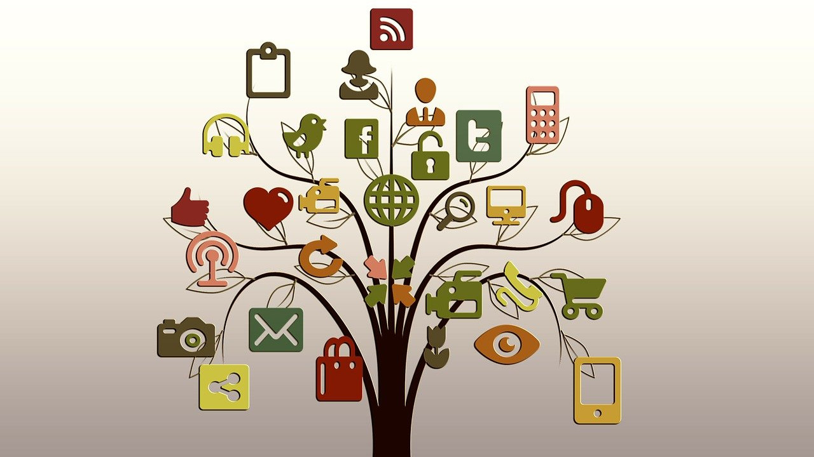
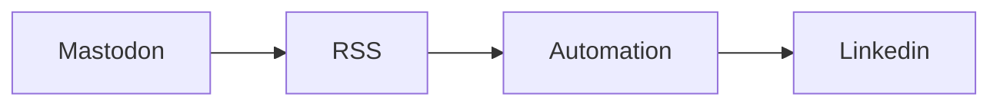
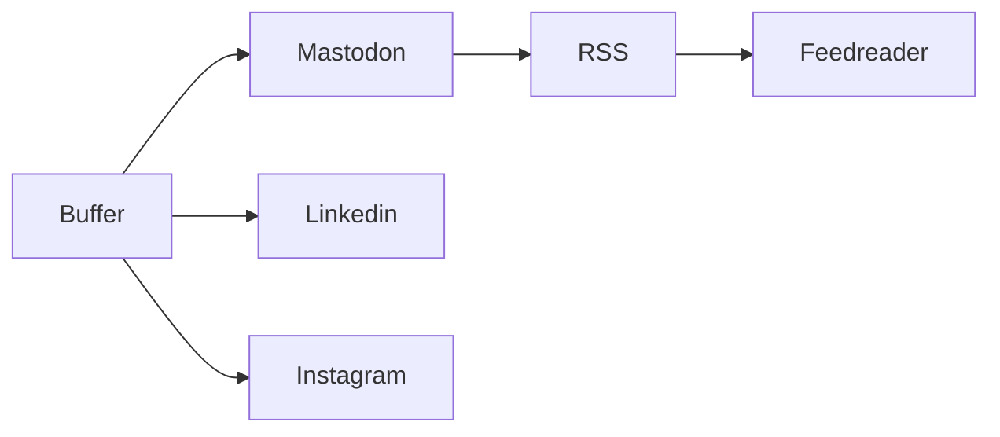
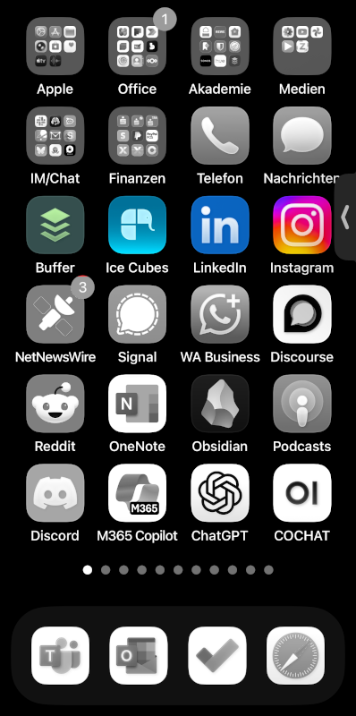

# Neue Social Media Strategie

Ich habe jetzt eine Weile - eigentlich [seit es Twitter nicht mehr gibt](https://simondueckert.github.io/tweetbook/) - mit den verschiedenen  **für mich relevanten Social-Media-Kanälen** herumexperimentiert. Auf **Mastodon** fühle ich mich am meisten "zu Hause". Auf **Linkedin** sind viele Leute aus meinem Netzwerk, aber der Feed ist wegen Werbung, Selbstdarstellung und zunehmend [AI Slop](https://en.wikipedia.org/wiki/AI_slop) von durchwachsener Qualität. Die fachliche Diskussion ist überwiegend nach **Reddit**, **Discord** und **Discourse** abgewandert.

Gerade im B2B-Umfeld sind aber viele Leute auf **Linkedin**, **Youtube** und **Instagram**. Deswegen habe ich damit experimentiert nach dem POSSE-Prinzip einzelne Kanäle miteinander zu koppeln, musste dabei aber viele Kompromisse machen. Letztendlich bin ich bei einer Lösung angelangt, die sich erstmal tragfähig anfühlt.

<!-- more -->

## POSSE - Publish On Own Site, Syndicate Elsewhere

Im [Indieweb](https://indieweb.org/) gibt es das [POSSE-Prinzip](https://indieweb.org/POSSE), bei dem man Inhalte auf eigenen Seiten veröffentlicht und auf weiteren Plattformen ausspielt (syndiziert). Mein erster Ansatz war, [mein Profil auf Mastodon](https://colearn.social/@simondueckert) als Quelle (single source) zu verwenden und die Inhalte mit Automatisierungsdiensten nach Linkedin zu publizieren.

Als **Dienste für die Automatisierung** habe ich [IFTTT](https://ifttt.com), [n8n](https://n8n.io) und [Microsoft's Power Automate](https://de.wikipedia.org/wiki/Microsoft_Power_Automate) ausprobiert. Power Automate war mein Favorit, weil ich das ohnehin etwas tiefer lernen will. Der Trick war, dass ich durch **Anhängen von ".rss" an eine Mastodon-Profil** direkt [einen RSS-Feed meines Accounts](https://colearn.social/@simondueckert.rss) erhalte. Problem war aber, dass ich es nicht geschafft habe, dass die Bilder  aus dem Feed auch sauber in Linkedin dargestellt wurden.

## POSSE by App

Hinzu kam, dass man in meinem geschäftlichen Umfeld viele Leute hauptsächlich über Instagram erreicht. Power Automate hat zwar eine Verbindung (Connector) zum hauseigenen Linkedin, aber nicht zu Instagram. Deswegen habe ich mit [Buffer](https://buffer.com) eine App reaktiviert, die ich früher schon einmal für das zeitgesteuerte posten von Beiträgen verwendet habe. Weil Buffer damals kein Mastodon konnte, habe ich das dann nicht mehr verwendet. Mittlerweile geht das aber und ich kann **von Buffer aus bequem auf Mastodon, Linkedin und Instagram posten**.

Im Gegensatz zur Automatisierungslösung oben kann ich in Buffer für die einzelnen Plattformen noch extra Einstellungen vornehmen (z.B. Inhaltswarnung in Mastodon) und kann zeitgesteuert veröffentlichen. Ein weiterer Vorteil ist, dass ich wir früher bei Twitter auf Mastodon auch mal etwas schreibe (z.B. Kurze Gedanken, geteilte Links, Fragen), das nicht direkt auf anderen Plattformen erscheinen soll. Der Use Case wie im "good old" Video [Twitter in Plain English](https://www.youtube.com/watch?v=ddO9idmax0o) beschrieben wird so möglich, ohne mit Hashtag-Filtern etc. herumbasteln zu müssen.

<iframe width="560" height="315" src="https://www.youtube-nocookie.com/embed/ddO9idmax0o?si=GcK0wFpIx2tmeIAD" title="YouTube video player" frameborder="0" allow="accelerometer; autoplay; clipboard-write; encrypted-media; gyroscope; picture-in-picture; web-share" referrerpolicy="strict-origin-when-cross-origin" allowfullscreen></iframe>

Wer möchte, kann mir über den **Mastodon-RSS-Trick** natürlich so auch gerne im [Feedreader](https://wiki.cogneon.de/feedreader) folgen. So bin ich auf den wichtigsten Plattformen vertreten und alle können sich aussuchen, wo sie mir folgen möchten. Wenn eine der Plattformen mal der Enshittification zum Opfer fällt oder neue Plattformen auftauchen, kann ich mit diesem modularen Konzept flexibel darauf reagieren. Der Inhalt gehört dabei immer mir und ich wahre meine [Digitale Souveränität](https://de.wikipedia.org/wiki/Digitale_Souver%C3%A4nit%C3%A4t).

Um **auf dem Smartphone** im Blick zu haben, falls es Kommentare oder andere Aktivitäten auf einer der Plattformen gibt, habe ich mir die vier Apps in einer Zeile auf dem Homescreen angeordnet:

