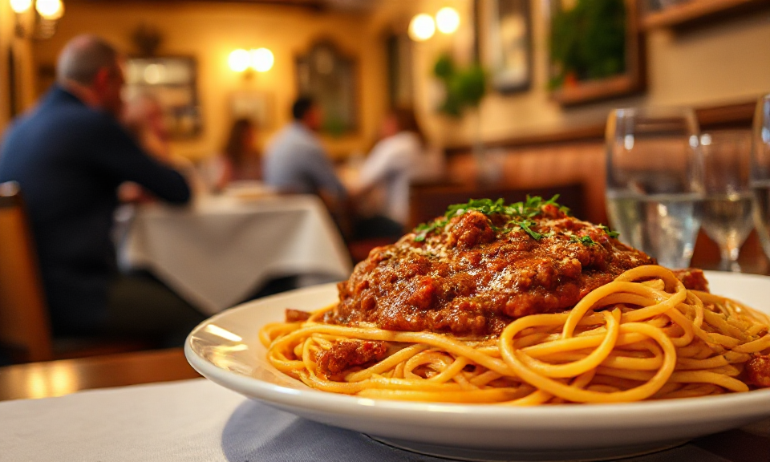

# Spaghetti Bolognese Revisited

Im Jahr 2023 hat die [Accademia Italiana Della Cucina](https://www.accademiaitalianadellacucina.it/) nach über 40 Jahren zum ersten Mal das Rezept für **Spaghetti Bolognese** geändert ([PDF](https://www.accademiaitalianadellacucina.it/sites/default/files/Rag%C3%B9%20alla%20bolognese%20-%20ricetta%20aggiornata%2020%20aprile%202023.pdf)). Das authentische [Ragù alla Bolognese](https://de.wikipedia.org/wiki/Rag%C3%B9_alla_bolognese) ist mehr als eine einfache Hackfleischsauce. Die Spezialität aus der [Emilia-Romagna](https://de.wikipedia.org/wiki/Emilia-Romagna) gelingt durch lange Zubereitung und hochwertigen Zutaten. Das Ergebnis ist: eine cremige, dunkel-orangefarbene Sauce, die jeden Bissen zum Erlebnis macht. Das Rezept mache ich gerne, wenn ich Zeit habe, die Zutaten schon Samstag früh auf dem Markt zu kaufen und die Sauce dann den ganzen Nachmittag vor sich hin köcheln kann.

<!-- more -->

## Besonderheiten

- **Lange Garzeit**: Mit 2-3 Stunden Schmordauer entwickelt die Sauce ihre volle Tiefe und samtige Textur
- **Qualität der Zutaten**: Traditionell wurde das Zwerchfell vom Rind verwendet, heute eignen sich kollagenreiche Schnitte wie Schulter, Bug oder Brust
- **Die richtige Konsistenz**: Das Ragù sollte cremig und umhüllend sein, nicht wässrig
- **Authentischer Geschmack**: Frische Pancetta und fein gehackte (nicht gemixte!) Gemüse bilden die aromatische Basis
- **Vielseitige Verwendung**: Perfekt zu Tagliatelle, für Lasagne oder andere Pastagerichte

## Zutaten (für 6 Portionen)

**Für das Ragù:**

- 400 g grob gehacktes Rindfleisch (Schulter, Bug, Brust oder gemischt)
- 150 g frische Schweinepancetta in Scheiben
- 60 g Zwiebel (etwa ½ Zwiebel)
- 60 g Karotte (etwa 1 Karotte)
- 60 g Staudensellerie (etwa 1 Stange)
- 1 Glas Rot- oder Weißwein
- 200 g passierte Tomaten
- 1 EL Tomatenmark (doppelt konzentriert)
- 1 Glas Vollmilch (optional, aber empfohlen)
- Fleisch- oder Gemüsebrühe nach Bedarf
- 3 EL natives Olivenöl extra
- Salz und Pfeffer

## Zubereitung

1. **Basis vorbereiten**: Die Pancetta fein hacken oder durch den Fleischwolf drehen. In einem schweren, hochwertigen Topf (24-26 cm Durchmesser, antihaftbeschichtet, Aluminium oder emailliertes Gusseisen) mit 3 EL Olivenöl bei mittlerer Hitze auslassen.

2. **Soffritto anbraten**: Zwiebel, Karotte und Sellerie sehr fein auf einem Schneidebrett hacken (kein Mixer verwenden!). Zum ausgelassenen Fett geben und bei mittlerer bis niedriger Hitze langsam glasig dünsten. Dabei ständig mit einem Holzlöffel rühren. Die Zwiebel darf auf keinen Fall anbrennen oder einen verbrannten Geschmack annehmen.

3. **Fleisch anbraten**: Hitze erhöhen und das Hackfleisch hinzufügen. Unter ständigem Rühren etwa 10 Minuten braten, bis es "brutzelt" und gut gebräunt ist.

4. **Mit Wein ablöschen**: Den Wein angießen und vollständig verdampfen lassen, bis kein Weingeruch mehr wahrnehmbar ist. Tomatenmark und passierte Tomaten unterrühren.

5. **Lange schmoren**: Eine Tasse heiße Brühe (oder heißes Wasser) angießen und gut vermischen. Den Topf abdecken und bei niedriger Hitze 2-3 Stunden köcheln lassen. Nach Bedarf immer wieder heiße Brühe nachgießen, damit die Sauce nicht antrocknet.

6. **Milch hinzufügen**: Nach der Hälfte der Garzeit nach alter Tradition die Milch zugeben und vollständig einkochen lassen.

7. **Abschmecken**: Am Ende der Garzeit mit Salz und Pfeffer abschmecken. Das Ragù sollte eine schöne dunkel-orangefarbene Farbe haben und cremig-umhüllend sein.

## Variationen

**Erlaubte Varianten:**

- Fleischmischung aus 60% Rind und 40% Schwein (Lende oder Nacken)
- Mit dem Messer gehacktes Fleisch statt Hackfleisch
- Gerollte Pancetta statt frischer Pancetta
- Eine Prise frisch geriebene Muskatnuss

**Nicht erlaubte Abwandlungen:**

- Kalbfleisch
- Geräucherte Pancetta
- Nur Schweinefleisch
- Knoblauch, Rosmarin, Petersilie oder andere Kräuter und Gewürze
- Brandy statt Wein
- Mehl zum Andicken

**Bereicherungsmöglichkeiten:**

- Hühnerleber, -herzen und -mägen
- Enthäutete und zerkrümelte Schweinebratwurst
- Blanchierte Erbsen (am Ende der Garzeit zugeben)
- Eingeweichte getrocknete Steinpilze

**Tipp:** Für eine moderne Variante können die Fleischstücke separat scharf angebraten und dann erst mit dem bereits angebratenen Gemüse-Soffritto vermischt werden.