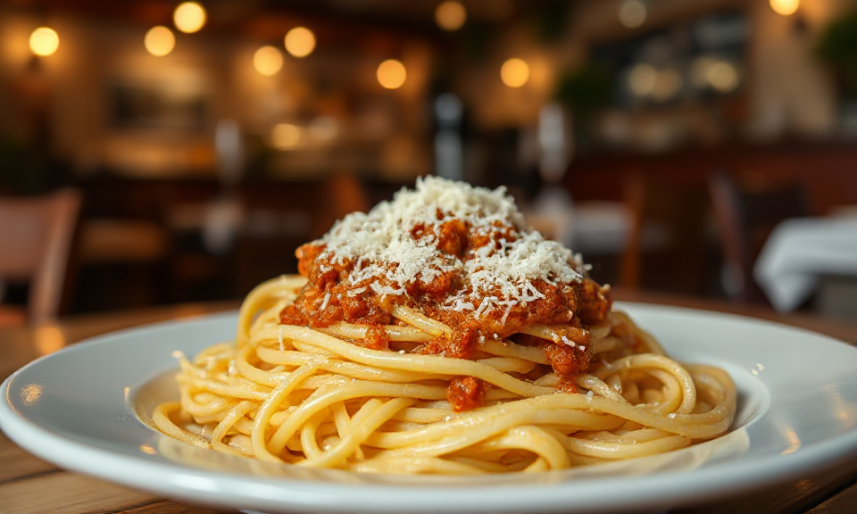

# Räuchertofu Bolognese
Ich bin zwar kein Vegetarier, aber ich versuche trotzdem wo möglich, Fleisch wegzulassen. Vor einiger Zeit haben wir mal alle möglichen Varianten der vegetarischen Bolognese auszuprobieren. Die mit Räuchertofu hat uns am besten geschmeckt (auch wenn uns [das neue Origninal-Rezept](https://www.falstaff.com/at/rezepte/kochen/original-ragu-alla-bolognese-aus-bologna) noch besser schmeckt).

## Zutaten

- 400 g Tofu, geräuchert
- 2 TL dunkle Sojasauce
- 1 Suppengrün
- 2 Zwiebeln
- 500 ml Tomaten, stückig (frisch oder Dose)
- 1 EL Olivenöl
- 100 ml Rotwein
- 100 gr Butter
- 500 ml Gemüsebrühe
- 500 gr Spaghetti
- Parmesan zum Reiben

## Zubereitung

1. Den Tofu in Würfel schneiden und dass Wasser möglichst gut herauspressen; anschließend mit einer Gabel zerkrümeln
1. Zerkrümelten Tofu in Sojasauce marinieren
1. Suppengrün für das für [Soffritto](https://de.wikipedia.org/wiki/Soffritto) zerkleinern
1. Zerkleinertes Suppengrün in einer Pfanne mit Butter und Prise Salz glasig dünsten
1. Tofu in einer Pfanne mit Olivenöl anbraten (soll Farbe annehmen, aber nicht anbrennen)
1. Tofu mit Gemüsebrühe ablöschen, Tomaten, Wein und Soffritto hinzufügen
1. Sauche 30 Minuten köcheln lassen und gelegentlich umrühren
1. Pasta kochen und mit Sauce und Parmesan servieren