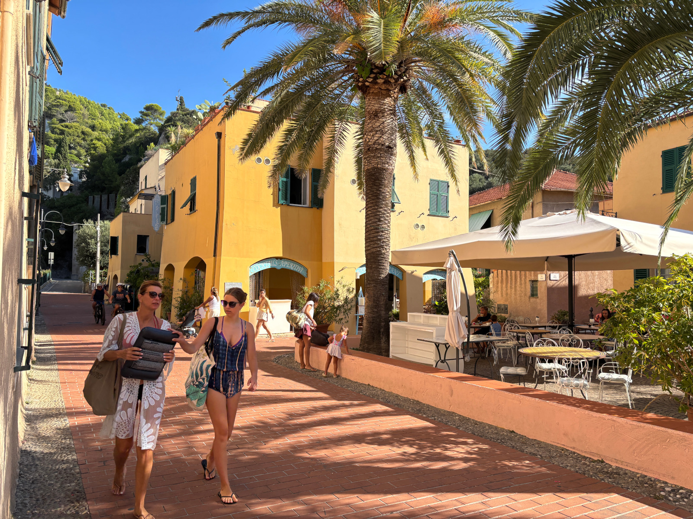
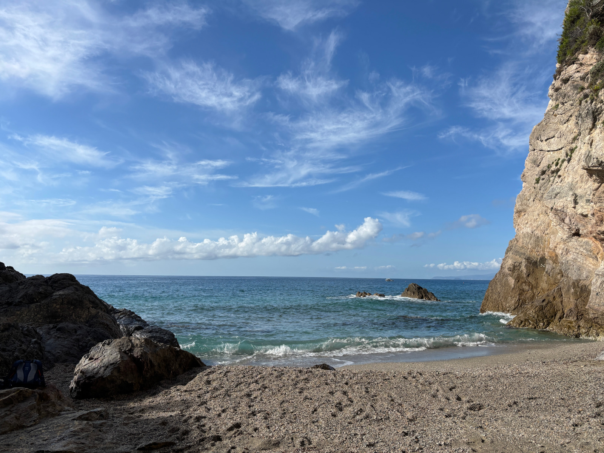
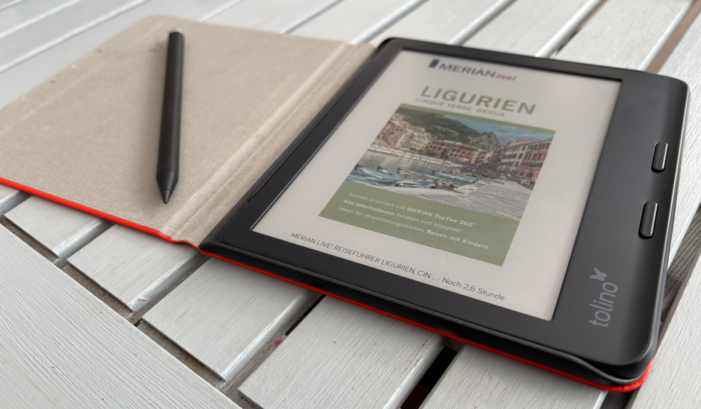

# Urlaub in Varigotti (Ligurien, Italien)

Dieses Jahr waren wir im Urlaub in [Varigotti](https://en.wikipedia.org/wiki/Varigotti) ([Ligurien](https://de.wikipedia.org/wiki/Ligurien)) in Italien. Wir hatten mit dem [Hotel Arabesque](https://www.hotelarabesque.it) eine gemütliche Unterkunft mit Frühstück **nur zwei Minuten vom Strand** weg gebucht.

<!-- more -->

Im **nördlichen Teil Italiens** waren wir noch nicht so oft und so hatten wir uns den Teil westlich von Genua, die [Riviera di Ponent](https://de.wikipedia.org/wiki/Riviera_di_Ponente) ausgesucht. Die Landschaft mit den Bergen, die fast bis zum Meer gehen, ist sehr schön. Auch die **Ligurische Küche** hat uns mit [Pesto alla Genovese](https://de.wikipedia.org/wiki/Pesto), Farinata (Fladen aus Kichererbsenmehl), [Pansoti](https://www.essen-und-trinken.de/rezepte/57714-rzpt-pansotti-con-salsa-di-noci-gefuellte-teigtaschen-mit-walnusssauce) (Teigtaschen mit Walnuss-Füllung) und [Trofie](https://de.wikipedia.org/wiki/Trofie)-Nudeln sehr gut geschmeckt. Einige Flaschen der lokalen Weinsorte [Pigato](https://de.wikipedia.org/wiki/Pigato) haben wir natürlich auch mitgenommen.

Von Varigotti aus erreicht man **alle umliegenden Ortschaften** an der Küste ([Noli](https://de.wikipedia.org/wiki/Noli_(Ligurien)), [Finale Ligure](https://de.wikipedia.org/wiki/Finale_Ligure) etc.) mit der [Buslinie TPL 40](https://www.tpllinea.it/), nach [Genua](https://de.wikipedia.org/wiki/Genua) fährt man bequem von Finale Ligure aus mit der Bahn (eine gute Stunde). Das Auto blieb die ganzen 10 Tage stehen, die Parkplatzsituation ist eh problematisch (wenig weiß markierte Parkplätze und die sind meist belegt). An den Autobahnen ist das Laden des E-Autos problemlos möglich gewesen, in den Orten gibt es wenig bis keine öffentlichen Lademöglichkeiten (Tipp: App [Chargemap](https://de.chargemap.com/)). Auch wenn er nur mit etwas kraxeln zu erreichen ist, sollte man auf jeden Fall den [Strand Punta Crena](https://www.komoot.com/de-de/highlight/568860) besuchen, denn da ist man meist alleine unterwegs.

Zum Lesen hatte ich mir einen **neuen E-Book-Reader** besorgt, da mein alter das zeitliche gesegnet hatte. Da ich mein [Remarkable 2](https://remarkable.com/products/remarkable-2) Tablet wegen nicht-Verfügbarkeit des [KOReader](https://koreader.rocks/) und Cloud-Zwang eigentlich verkaufen wollte, habe ich das nicht verwendett. Ich hatte mir dann einen [Tolino Vision Color](https://mytolino.de/produkte/tolino-vision-color/) mit Stift geholt. Leider hat mir die Verkäuferin einen falschen Stift verkauft, so dass ich zur Stifteingabe noch nicht viel sagen kann.

Aber das quadratische Format des **Tolino Vision Color** und der etwas dickere Rand rechts fühlt sich sehr gut an. Auch die Schutzhülle macht einen wertigen Eindruck. Die Farben sind etwas blass aber erkennbar. KOReader hab ich noch nicht installiert, aber das werde ich im nächsten Schritt tun. Nach dem Urlaub habe ich noch entdeckt, dass man KOReader mittlerweile auch [auf einem Remarkable 2 mit aktueller Firmware](https://github.com/koreader/koreader/wiki/Installation-on-reMarkable#manual-installation-on-remarkable-1--2-on-firmware-320-or-later) installieren kann. Habe ich gleich probiert und das hat auch gut geklappt.