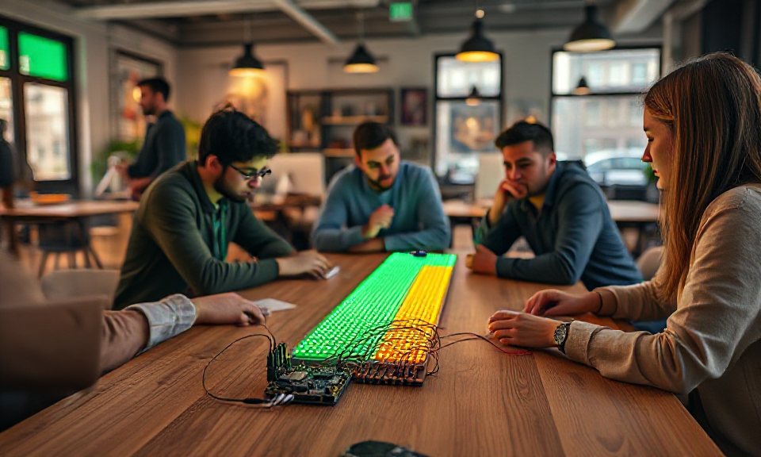
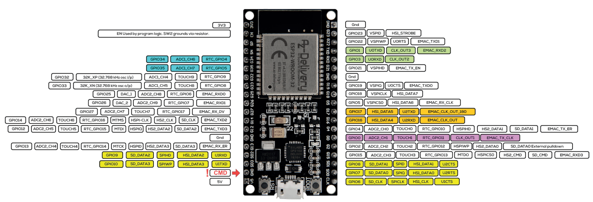
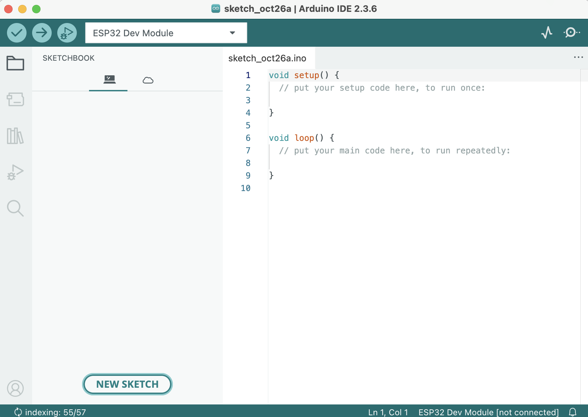
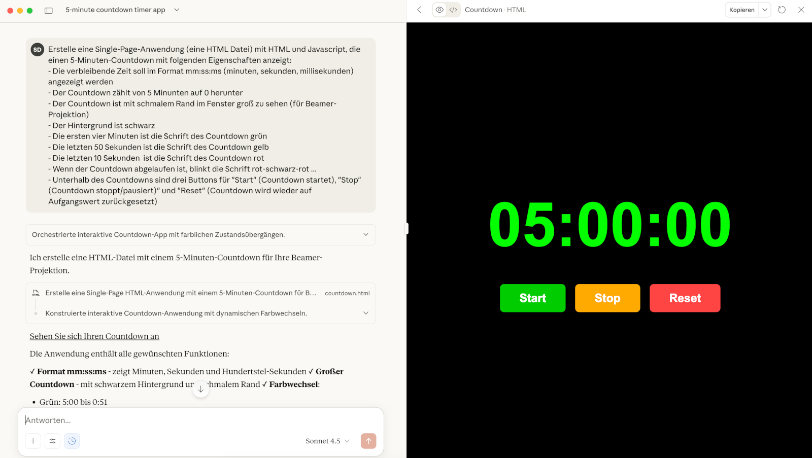

# Vibe Coding mit ESP32s



Seit meinem letzten [Blog zur LED-Lightning-Talk-Lampe](https://blog.dueckert.eu/2025/10/13/led-lightning-talk-lampe-mit-vibe-coding/) habe ich etwas darüber nachgedacht, welche DIY-Aktion wir nächstes Jahr in der lernOS Convention 2026 (23.-24. Juni) machen könnten. Der Promtathon letztes Jahr, bei dem wir gemeinsam Challenges für KI gepromptet haben, kam sehr gut an. Deswegen soll es wieder etwas ähnlich interaktives geben, das man in Kleingruppen bearbeiten kann.

<!-- more -->

Thematisch wollen wir etwas mehr in Richtung **Automatisierung wissensintensiver Aufgaben zur Steigerung von Produktivität** gehen. Dafür kann man KI gut gebrauchen, aber es braucht auch andere Skills, wie sie in den letzten Jahren in der Low-Code-/No-Code-Bewegung entwickelt wurden (Programmierung, Skripting, Kommandozeile, zeitgesteuerte Aufgaben etc.).

Da viele Mitarbeitende in Unternehmen von ihrem Rechner hauptsächlich die **grafische Bedienoberfläche** (GUI) kennen, die **Kommandezeile** (CLI) noch nie gesehen haben, geschweige denn schon einmal Software entwickelt haben, suchen wir nach einem Ansatz, der Grundlagen für den **Future Skill "Technology use & control"**.

> Program or Be Programmed - Douglas Rushkoff

Im besten Sinne eines [CoderDojo](https://www.coderdojo-deutschland.de/) will ich mir hierzu eine Kata (Übung) ausdenken, die den Umgang mit **Hardware**, die Erstellung von **Software** und das **Zusammenführen zu einem Gesamtsystem** in einer kleinen Gruppe zum Ziel hat. In diesem Beitrag beschreibe ich erstmal die gewählte Plattform für das gemeinsame Lernen.

## Die Hardware - warum ESP32?

Mit [Raspberry Pi](https://de.wikipedia.org/wiki/Raspberry_Pi), [Arduino](https://de.wikipedia.org/wiki/Arduino_(Plattform)), [mikro:bit](https://de.wikipedia.org/wiki/BBC_micro:bit), [Calliope mini](https://de.wikipedia.org/wiki/Calliope_mini) uvm. gibt es eine Menge Basisplattformen, mit denen man einfache Anwendungen wie z.B. die Ansteuerung von LEDs (Leuchtdioden) bewerkstelligen kann. Ich habe mich aus folgenden Gründen für das ESP32 Development Board von Espressif entschieden:

1. Ich habe selbst **viel Erfahrung** damit. Mit Raspberrys habe ich auch Erfahrung, da dort aber in komplettes Linux-System läuft, ist der Raspi deutlich komplexer zum Einstieg.

2. Das Board ist **Arduino-kompatibel**, d.h. es gibt sehr viel Tutorials, Beispiele und Anwendungsideen dafür.

3. Das Board bringt die **wichtigste Hardware für die Konnektivität** bereits mit (für meinen Anwendungsfall z.B. WiFi und Bluetoot inkl. [Bluetooth LE](https://de.wikipedia.org/wiki/Bluetooth_Low_Energy)).

4. **Programmierbare LED-Streifen** wie z.B. [WS2812](https://starthardware.org/viele-leds-mit-arduino-steuern-ws2812/) können direkt an die Pins des Boards angeschlossen werden.

5. Über die **USB-Schnittstelle** (Mikro USB) lässt sich das Board direkt an einem Laptop mit Firmware bestücken.

6. Das [ESP32 Development Board](https://amzn.to/4qogum5) (*) ist mit ca. 10,- **sehr günstig**, was auch für andere Einsteiger:innen dür Hürde möglichst niedrig macht.

Das ESP32 Development Board besitzt **32 Pins auf dem Board** and die Peripherie wie LEDs direkt über Steckkabel und ohne Lötarbeit angeschlossen werden können (Bild: [AZ Delivery](https://cdn.shopify.com/s/files/1/1509/1638/files/ESP-32_NodeMCU_Developmentboard_Pinout.pdf?v=1609851295)).



## Die Software - Arduino IDE oder Visiual Studio Code

Über die **Mikro-USB-Buchse** kann das Board direkt an den Computer angeschlossen werden. Um eine **neue Firmware auf das Board** zu übertragen braucht es auf dem Laptop eine dafür geeignete Software wie z.B.

- [Ardunio IDE](https://www.arduino.cc/en/software/) mit dem [ESP32-Support von Espressif](https://docs.espressif.com/projects/arduino-esp32/en/latest/installing.html)

- [Visual Studio Code](https://code.visualstudio.com/) mit [PlatformIO IDE](https://platformio.org/)

Die **Struktur einer IDE** ist wie ein Datei-Explorer, links sieht man die Dateien und Ordner eines Projekts und rechts den Inhalt (i.d.R. Quelltext einer Software) der Datei:



**Tipp:** wer z.B. mit Kindern erstmal ein schnelles Erfolgserlebnis haben möchte (Kinder lieben bunte LEDs), kann mit der [WLED-Firmware](https://kno.wled.ge/) starten, das [direkt über den Webbrowser ohne zusätzliche Software](https://install.wled.me/) auf dem eigenen Computer installiert werden kann (dafür braucht es erstmal keine IDE).

## Vibe Coding - Programmieren oder Programmieren lassen, das ist hier die Frage

Anfang 2025 hat **Andrew Karpathy** den Begriff ["Vibe Coding"](https://en.wikipedia.org/wiki/Vibe_coding) aufgebracht. Dabei geht es darum, den Quellcode für eine Software nicht mehr selbst zu erstellen, sondern ganz oder in Teilen von einem KI-Tool erstellen zu lassen. Das geht direkt in Chatbots wie ChatGPT, Microsoft Copilot, Claude etc., oder in speziellen KI-IDEs wie z.B. [Cursor](https://cursor.com/) oder [Manus](https://manus.im/).

Das kann man z.B. mal mit folgendem Prompt im KI-Tool der Wahl ausprobieren, der einen **HTML-Code für einen 5-Minuten-Countdown** erstellt. Der Code muss dann nur noch in eine Datei mit der Endung .html gespeichert und in einem Browser geöffnet werden.

```
Erstelle eine Single-Page-Anwendung (eine HTML Datei) mit HTML und Javascript, die einen 5-Minuten-Countdown mit folgenden Eigenschaften anzeigt:

- Die verbleibende Zeit soll im Format mm:ss:ms (minuten, sekunden, millisekunden) angezeigt werden
- Der Countdown zählt von 5 Minunten auf 0 herunter
- Der Countdown ist mit schmalem Rand im Fenster groß zu sehen (für Beamer-Projektion)
- Der Hintergrund ist schwarz
- Die ersten vier Minuten ist die Schrift des Countdown grün
- Die letzten 50 Sekunden ist die Schrift des Countdown gelb
- Die letzten 10 Sekunden  ist die Schrift des Countdown rot
- Wenn der Countdown abgelaufen ist, blinkt die Schrift rot-schwarz-rot ...
- Unterhalb des Countdowns sind drei Buttons für "Start" (Countdown startet), "Stop" (Countdown stoppt/pausiert)" und "Reset" (Countdown wird wieder auf Aufgangswert zurückgesetzt)
```

Das ist der Screenshot eines Ergebnis des Prompts mit **Claude Sonnet 4.5**:



**Tipp:** auch wenn größere und komplexe Softwareprojekte aktuell am besten mit den großen, Cloud-basierten Sprachmodellen (LLMs) funktioniert, lohnt es sich für kleinere Projekte auch mal auf Coding spezialisierte **kleinere Sprachmodelle** wie z.B. [Qwen2.5-Coder](https://ollama.com/library/qwen2.5-coder) mit lokaler KI (z.B. [Ollama](https://ollama.com/), [Chatbox](https://chatboxai.app/), [LM Studio](https://lmstudio.ai/)) auszuprobieren.