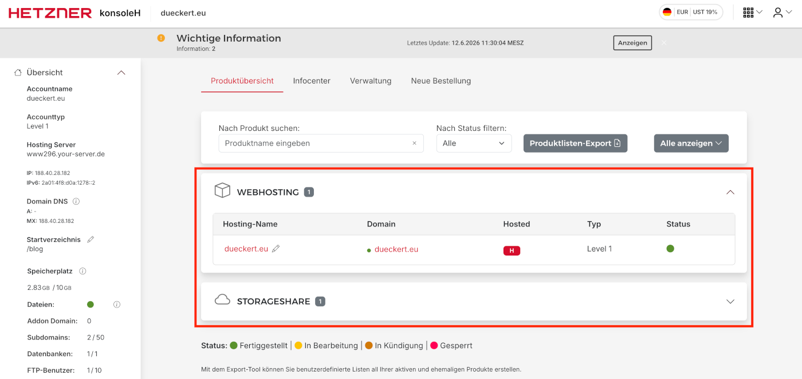
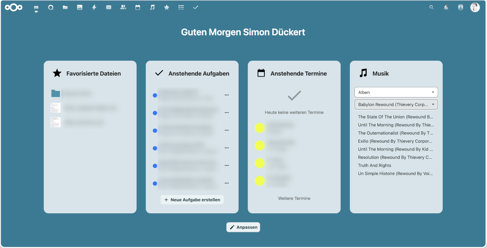

# Deine eigene Domain - ein Beitrag zum DigitalIndependenceDay

![Horizontal comic illustration divided into three connected sections, left to right, Left section: a happy diverse group of people using laptops, tablets and smartphones, smiling, gathered together, Middle section: a grid of simple flat icons representing digital formats, email envelope, chain link, contact card, PDF document, MP3 music note, arranged neatly, connecting lines flowing from left to right, Right section: a friendly smiling server tower character with a happy cartoon face, glowing status lights, standing on a simple globe representing the internet, flat vector comic style, bold clean outlines, bright flat colors, wide-angle shot, even studio lighting, no harsh shadows, warm orange, teal and white color scheme, clean flat shading, no gradients, connecting arrows or flow lines linking all three sections, small cloud and wifi symbols in the background, Style: friendly tech explainer comic. Mood: optimistic, empowering, approachable.](./images/diday-deine-eigene-domain-cover.png)

Letzte Woche war ich im Rahmen des [Nürnberger Digital Festivals](https://nuernberg.digital/) auf dem [IndieWebCamp](https://indieweb.org/IndieWebCamps). Das **"Indie Web"** versteht sich als **"people-focused" Alternative** zum **"Corporate Web"**, also zu dem Teil des Webs, das kommerzielle Interessen verfolgt und in dem man nicht Kunde, sondern Produkt ist (Werbung, Datenverkauf). Im Indie Web soll der eigene Inhalt einem selber gehören, man soll sich mit anderen vernetzen können und man soll Kontrolle über die eigenen Daten haben (Bild mit lokaler KI FLUX.2 erstellt).

<!-- more -->

Damit ist die **Idee des Indie Web** gar nicht weit weg von der des [Digital Independence Day](https://di.day/de). Auch da geht es darum, mit der eigenen Darstellung und den den eigenen Aktivitäten im Web nicht die **Monopolstellung von BigTech** (Google, X, Facebook etc.) zu fördern, sondern das eigene **digitale Leben** in **Freiheit** zu gestalten. Doch das ist in der Praxis gar nicht so leicht.

Beim **IndieWeb Camp** war die **eigene Website der zentrale Anker einer Person im Web**, meist mit einer Kombination aus **statischen Seiten** (z.B. Profil, Portfolio, CV) und **dynamischen Inhalten** (z.B. Blog, Microblog, Podcast). [Digitale Souveränität](https://de.wikipedia.org/wiki/Digitale_Souver%C3%A4nit%C3%A4t) heißt dabei nicht notwendigerweise, Server und Software auch selbst zu betreiben. Das ist gerade für Newbies eine große Hürde, wie wir im Projekt [Domain of One's Own der Corporate Learning Community](https://colearn.de/clc-dooo-hackathon-vorbereitung-fuer-teilgebende/) schmerzhaft gelernt haben.

Trotzdem ist die **eigene Domain** die Voraussetzung für digitale Unabhängigkeit, denn ähnlich wie ich meine Mobilfunknummer beim Providerwechsel mitnehmen kann, kann ich auch meine Inhalte im Web mit einer eigenen Domain **problemlos zu einem anderen Anbieter umziehen** - oder sogar später ins [Self-Hosting](https://en.wikipedia.org/wiki/Self-hosting_(network)) wechseln.

!!! tip "Tipp"
    Wer es zum Einstieg ganz einfach haben möchte, kann sich erstmal den [kostelosen Tarif von Wordpress.com](https://wordpress.com/de/pricing/#lpc-pricing) buchen (hatte ich auch mal), aber da habt ihr dann keine eigene Domain.

Meist möchte man neben der eigenen Domain mit Website gleich auch **bei weiteren Annehmlichkeiten des digitalen Lebens unabhängig** sein. Dazu gehören z.B. E-Mail, Dateiablage, Kontaktverwaltung, Kalender, Aufgabenlisten - im Prinzip das, was einem z.B. Microsoft 365 oder Google anbieten.

Wie in den [Wechselrezepten des Di.Day](https://di.day/de/wechselrezepte) beschrieben, kann man **für die meisten Anwendungen selbstgehostete Alternativen** finden (z.B. Rezept [Nextcloud - Deine eigene Wolke](https://di.day/de/wechselrezepte/nextcloud)). Für viele Einsteiger:innen, die den Komfort bestehender Webdienste gewohnt sind, ist das aber schon zu kompliziert und birgt auch gewissen Risiken (z.B. muss man sich um Sicherheit, Updates, Backup etc. selbst kümmern).

Deswegen hier **ein Vorschlag**, wie es zum Einstieg etwas einfacher geht. Der Vorschlag ist **praxiserprobt**, da es sich genau um das Setup handelt, das ich für die Familie aufgesetzt habe, um Web.de-Mail, Google-Mail, Dropbox & Co. loszuwerden (habe [hier](../2022/ein-eigener-server-fuer-privatpersonen-und-familien.md) schonmal drüber geschrieben). Im Folgenden die zentralen **Zutaten für das Wechselrezept**.

!!! note "Hinweis"
    Ich bin bei dem in Franken ansässigen Hoster [Hetzner](https://de.wikipedia.org/wiki/Hetzner_Online), das Rezept lässt sich aber auch bei anderen Anbietern umsetzen.

## Webhosting - ein Webserver inkl. Datenbank(en) und E-Mail-Adressen

1. Die **Webhosting-Pakete** sind bei Hetzner nach T-Shirt-Größen von S bis XL benannt, sie lassen sich über eine Weboberfläche administrieren (s.o.).
1. Für den Einstieg reicht das **kleinste Paket S** (€ 1,90/Monat) in dem man 10GB Web-Speicherplatz und 100 E-Mail-Adressen inklusive erhält.
1. Eine **Datenbank** ist auch dabei, falls man aus der [Auswahl an Cloud Apps](https://docs.hetzner.com/de/cloud/apps/overview) z.B. Wordpress für Website/Blog verwenden  möchte.
1. Verwendet man die Hetzner **Cloud App Wordpress**, kümmert sich der Hoster um Installation, Einrichtung, Backup und Update, was einen erst einmal sorgenfrei starten lässt.
1. Für aktuell € 5,83/Jahr lässt sich eine **eigene Domain** dazu buchen, womit die Anforderung nach der eingenen Domaine erfüllt wäre; Ich verwende einfach den Nachnamen als Domain (s.a. [blog.dueckert.eu](https://blog.dueckert.eu)).
1. Unter der Domain können dann auch die **E-Mail-Adressen** einrichten, die über einen einfachen Spamfilter verfügen und in beliebigen E-Mail-Clients angebunden werden können (ich nutze z.B. [Thunderbird](https://www.thunderbird.net/de/) und Apple Mail).

## Nextcloud - das Schweizer Taschenmesser für den digitalen Arbeitsplatz

1. Neben dem Webosting bietet Hetzner auch ein **gehostetes Nextcloud-Paket** mit dem Namen [Storage Share](https://www.hetzner.com/de/storage/storage-share/) an.
1. Bei **Storage Share** gibt es die [Pakete NX11, NX21 und NX31](https://www.hetzner.com/de/storage/storage-share/). Für den Einstieg reicht das **Paket NX11**, das bei € 5,11/Monat bereits 1TB Speicher und beliebig viele Nutzer zulässt.
1. In dem Paket sind **drei Subdomains** inklusive, so dass man z.B. cloud.eigenedomain.de als Subdomain für Nextcloud verwenden kann (ich nutze so z.B. [cloud.dueckert.eu](https://cloud.dueckert.eu)).
1. Da es sich um einen **"managed" Nextcloud-Server handelt**, kümmert sich Hetzner um Update und Backup, was sehr bequem ist und bisher keine Probleme gemacht hat.
1. Nextcloud kommt bereits mit **Funktionen** wie Filehosting/-sharing. Über die Einstellungen lassen sich unter *Apps* weitere [Nextcloud Apps](https://apps.nextcloud.com/) installieren. Um die Aktualisierung installierter Apps muss man sich selbst kümmern, das geht aber genauso einfach, wie auf dem Smartphone. Ich habe **zusätzlich folgende Apps** installiert:
    1. **Bookmarks** - um meine Lesezeichen/Favoriten Browser-übergreifend zu verwalten
    1. **Contacts** - zur Kontaktverwaltung, synchronisiert bei mit mit Thunderbird, iPhone
    1. **Forms** - um Formulare und Abfragen erstellen zu können
    1. **Mail** - als leichtgewichtiger Webmailer, falls ich mal von unterwegs und ohne eigenes Endgerät auf Mails zugreifen muss (selten)
    1. **Music/AudioPlayer** - zum Abspielen meiner Musikbibliothek in Nextcloud
    1. **Talk** - für Chat und Videokonferenzen mit kleinen Gruppen (<10), idR verwenden wir iMessage oder Signal
    1. **Tasks** - zur Aufgabenverwaltung, integriert in den Kalender, synchronisiert mit Thunderbird und Apple Erinnerungen

Für **beide Dienste** zahlt man zusammen inkl. Domain also **unter € 10/Monat** und ist dabei dahingehend digital unabhängig, dass die eigenen Daten einem selbst gehören und man zu einem späteren Zeitpunkt sogar ins Self Hosting wechseln kann. Ich wünsche viel Spaß und Erfolg beim "nachkochen" des Wechselrezepts 👍