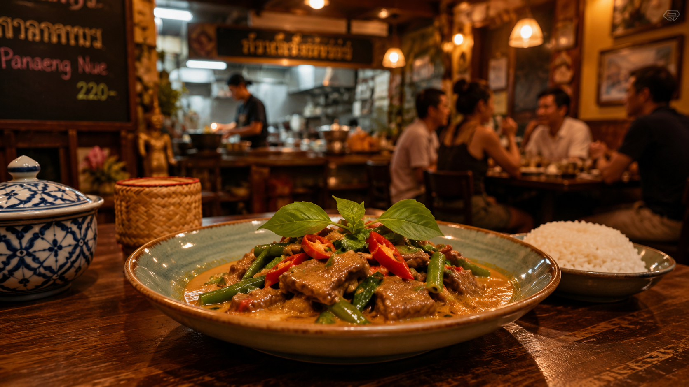

# Thailändische Küche

Auch wenn ich noch nie in [Thailand](https://de.wikipedia.org/wiki/Thailand) war, bin ich ein großer Freund der [thailändischen Küche](https://de.wikipedia.org/wiki/Thailändische_Küche). Diesen Beitrag lege ich mal an, um Informationen und Rezepte zu sammeln.

<!-- more -->

Ich habe lange Zeit in der Nähe des Lokals [Thai Food 1](https://www.thaifood1.de) in Nürnberg gewohnt. Über viele Jahre aind wir mit der Hausgemeinschaft so gut wie jeden  ontag dort gewesen.

Von aussen sieht das gar nicht spektakulär aus, nur wenige Tische, eine kleine und einsehbare Küche und ein Kühlschrank mit Getränken zur Selbstbedienung - wahrscheinlich ist es normal, dass man in Franken kein Fan des thailändischen Biers wird 😉 An der Wand viele Bilder aus Thailand und natürlich Königin und König.

Meine Favoriten von der [Speisekarte](https://www.thaifood1.de/speisekarte/) sind im Lauf der Zeit **Tom Ka Gai** (Kokosmilchsuppe), **Laab Gai** (lauwarmer Salat mit Huhn), **Ped Pad Pet** (Ente mit Chili) und **Panaeng Neua** (rotes Curry mit Rind) geworden und ich habe angefangen, die Gerichte nachzukochen.

## Rezepte
- [Panaeg Neua](https://kratai.de/2025/12/02/panang-curry-mit-rind-cremig-nussig-kaffir-duftend-authentisches-thai-rezept-fur-zuhause/) (Nationalgericht)