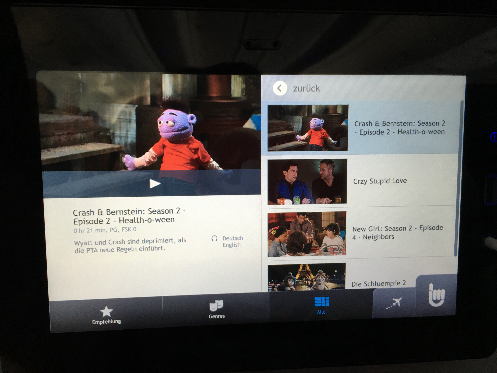

Der Flug FFM-CUN war ruhig, mit 11h und Kind aber trotzdem kein Zuckerschlecken. Der Flug war mit Condor in einer Boing 747 und sehr eng geschraubten Sitzen. Die Digitalisierung scheint hier auch noch nicht angekommen zu sein: kein WiFi und das Entertainment-Programm war mit zwei Serien-Folgen und zwei Filmen sehr mager. Das mutet in Zeiten von Netflix, iTunes, Spotify & Co. schon fast mittelalterlich an. Glücklicherweise waren wir mit einem iPad Multimedia-Selbstversorger.  Und auch eine Lerngelegenheit gab es auf dem Flug. Im Sitz vor mir konnte ich beim Spiel "2048" einen Spielstand von über 50.000(!) entdecken. Habe eine Weile zugeschaut und versucht die Spielstrategie zu kopieren. Mit über 20k konnte ich meinen neuen Beststand erreichen. Tacit Knowledge Transfer - I like!

