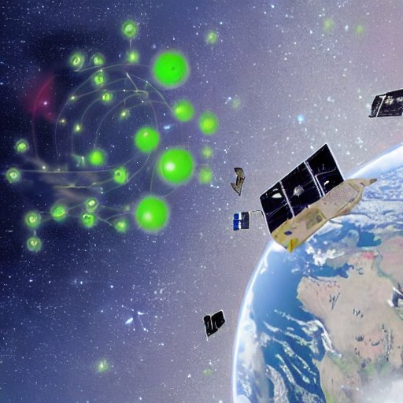

Auch dieses Jahr gibt es leider wieder keinen [Chaos Communication Congress](https://de.wikipedia.org/wiki/Chaos_Communication_Congress). Anders als in den letzten beiden Jahren, gibt es auch keinen zentral organisierten Remote-Congress (rC3), es gab einen Aufruf, **im Zeitraum 27.-30.12.2022** [dezentrale Jahresendveranstaltungen](https://events.ccc.de/2022/11/28/dezentral-2022/) zu organisieren. Dem Aufruf sind zum Glück auch viele Wesen nachgekommen ([Übersicht](https://events.ccc.de/2022/11/28/dezentral-2022/#dezentral-2022-events)).

<!-- more -->

**Ich sammle hier einige Links und Infos:**

- [Sendegate JEV22](https://sendegate.de/t/sendegate-jev22/15763), eine (kleine) Anlaufstelle für die Podcasting-Community wieder mit dem virtuellen Sendezentrum (Workadventure)

- [Wintergalaktische Club Mate Party](https://w.icmp.camp/) in Erlangen, dort werde ich die meiste Zeit sein

- [Linksammlung](https://lab.nrw/hedgedoc/_hV5kXt9TKuiV0DVsdIwgg#) zu den JEV22 Veranstaltungen

- Programm: [c3voc Gesamt Fahrplan JEV22](https://pretalx.c3voc.de/jev22/schedule/) und [alternativer Fahrplan](https://dezentrale-jahresendveranstaltungen.fyi/)
