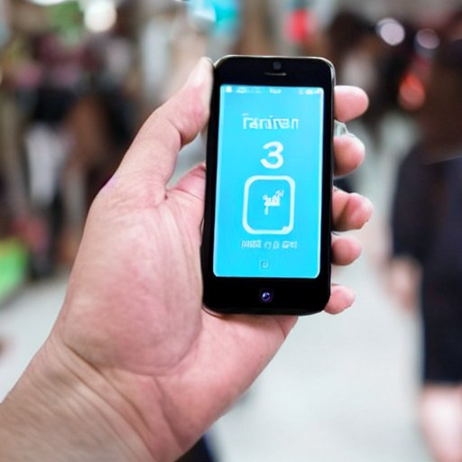

Da wir bei [Cogneon](https://cogneon.de) schon sehr lange von Windows Phones auf iPhones umgestiegen sind, habe ich kaum Erfahrungen mit dem mobilen Betriebssystem [Android](https://de.wikipedia.org/wiki/Android_\(Betriebssystem\)). Im Herbst 2021 habe ich das Experiment gemacht, beim Arbeiten auf dem Laptop wochenweise zwischen Windows (10), Mac und Linux ([Kubuntu](https://de.wikipedia.org/wiki/Kubuntu)) zu wechseln. Im Herbst 2022 will ich mal ausprobieren, am Wochenende ein Android-Telefon zu verwenden.

<!-- more -->

Als Gerät dafür habe ich mir ein [Fairphone](https://de.wikipedia.org/wiki/Fairphone) 3+ ausgesucht (€ 349,-), da das auf lange Nutzungsdauern, fairen Einkauf und modularen Aufbau optimiert ist. Als Betriebssystem kam für mich ein reines Android nicht in Frage, da sich dort die Google-Telemetrie nicht ausreichend deaktivieren lässt. Ich habe mich für das "entgoogelte" Betriebssystem [/e/OS](https://e.foundation/de/e-os/) entscheiden, das auf Basis von [LineageOS](https://lineageos.org/) versucht, der Apple Usablity möglichst nahe zu kommen.

Im ersten Schritt habe ich das Telefon mal so eingerichtet, dass die Verbindungen funktionieren (WiFi, 5G, Bluetoot) und die Apps von meinem iPhone (soweit auf Android vorhanden) auch auf dem Fairphone vorhanden waren. Das hat alles in allem auch recht gut funktioniert. Bis Weihnachten werde ich das Telefon jetzt immer am Wochenende verwenden, um Erfahrungen zu sammeln, über die ich hier im Blog berichten werde.

## Offene Themen und Fragen

1. **Chat und Messenger** - iMessage funktioniert auf Android nicht, die Nachrichten-App kann nur SMS; Messenger wie Signal können nicht auf einem zweiten Mobiltelefon genutzt werden

3. **2FA Authenticator Apps** habe ich noch nicht eingerichtet (MS Authenticator, Authy)

5. **Obsidian** auf dem iPhone synchronisiert bei mit über iCloud, das geht auf Android nicht (will ich auf Nextcloud umstellen, das geht aber auf dem iPhone nicht)

7. **Kopfhöreranschluss** ist über 3,5mm Klinke oben, nicht Lightning unten (Adapter für USB-C unten beim Fairphone verwenden?) - werde mir kein iPhone mehr zulegen, dass kein USB-C kann

9. **Bluetooth Headsets** sind noch nicht alle gekoppelt

11. **Ladekabel** ist USB-C nicht Lightning

13. Erster Anlauf das Telefon im Auto über [**Android Auto**](https://de.wikipedia.org/wiki/Android_Auto) zu koppeln hat nicht funktioniert, ging nur über Bluetooth (Carplay mit dem iPhone lief problemlos)

15. **Apple Pay** ist auf Android nicht verfügbar, habe mir die mobilen Apps von Deutsche Bank und Sparkasse installiert, aber damit noch nicht gezahlt

17. Die **Apple Watch** lässt sich (natürlich) nicht mit dem Fairphone koppeln (eine weitere Uhr will ich aber nicht)

19. Für meine [**SP Connect Fahrradhalterung**](https://sp-connect.de/) habe ich noch nicht geschaut, ob es die auch für das Fairphone gibt

21. Meine **Wireguard-VPNs** habe ich noch nicht eingerichtet
