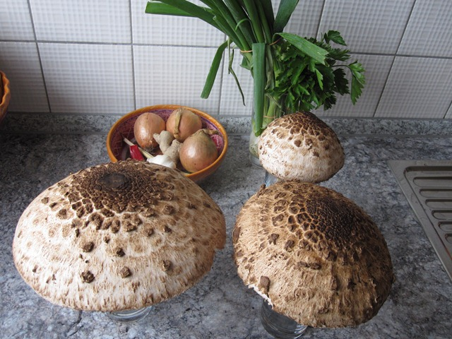
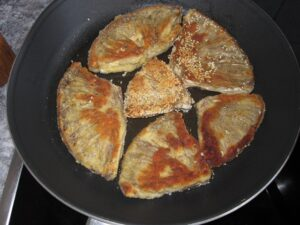

Auf meiner Kamera habe ich aus dem Herbst noch einige Fotos zu einem meiner Lieblingsrezepte gefunden: panierte [Parasol-Pilze](http://de.wikipedia.org/wiki/Parasol). Das Rezept ist denkbar einfach, das schwierige ist, die Parasol zu finden :)

<!-- more -->

**Zutaten:**

1. Ein großer Parasol je Person
2. Eier zum Panieren
3. Panat oder Semmelbrösel/Salz/Pfeffer

**Zubereitung:**

1. Parasol säubern und Stiele entfernen
2. Parasol erst in Ei und dann in dem Paniermehl wenden
3. In der Pfanne mit Öl oder Schmalz von beiden Seiten schön braun ausbraten

