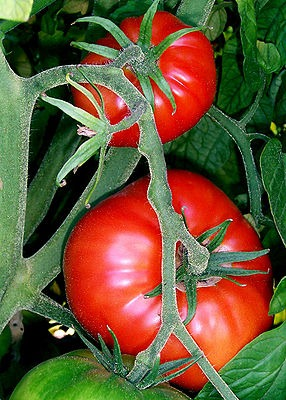

Als begeistertes [Slowfood-Mitglied](http://slowfood.de/) richtet sich unser Speiseplan natürlich nach dem Saisonkalender. Glücklicherweise wohnen wir direkt im Nürnberger Knoblauchsland und somit direkt an der Quelle für CO2-neutral hergestelltes Gemüse. Besonders freue ich mich jedes Jahr über die Tomaten-Zeit, denn dann gibt es leckeres Tomaten-Öl-Pickle (Rezept stammt ursprünglich aus einem uralten Brigitte-Viva-Heft):

<!-- more -->

**Zutaten:**

1. 2 kg feste Tomaten
2. 20(!) Knoblauchzehen
3. 185 g frische Ingwerknolle
4. 20 grüne Chilischoten
5. 75 ml Olivenöl
6. 1,5 EL Kurkuma
7. 4 EL gemahlener Kreuzkümmel
8. 1 EL Chilipulver
9. 375 ml Apfelessig
10. 250 g Zucker
11. 1 EL Salz

**Zubereitung:**

1. Die Tomaten häuten (einige Minuten in kochendes Wasser und dann die Haut abziehen und entkernen. Danach in mundgerechte Stücke schneiden.
2. Knoblauch, Ingwer und Chilischoten schälen und fein hacken.
3. Öl in einer großen Pfanne erhitzen und Kurkuma, Kreuzkümmel und Chilipulver darin kurz andünsten.
4. Knoblauch, Ingwer und Chili dazugeben und kurz mitdünsten.
5. Tomatenstücke, Essig, Zucker und Salz dazugeben und bei kleiner Hitze ca. 5-10 Minuten köcheln (nicht rühren).
6. Tomaten in Einmachgläser füllen und sofort verschließen.
