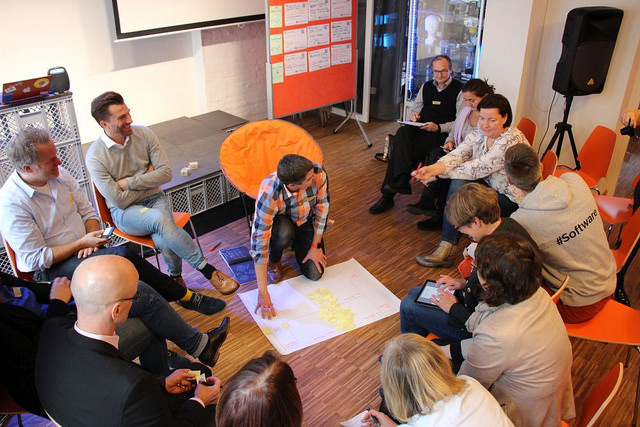

Am 25. Oktober 2019 hat Sabine auf LinkedIn [einen Beitrag](https://www.linkedin.com/pulse/working-out-loud-lernos-sabine-kluge) gepostet. In dem Beitrag sind einige inhaltliche Wertungen von lernOS enthalten (z.B. "didaktisch widersinnig", "komplexe Zusatzkomponenten"), auf die ich in diesem Blog nicht eingehen möchte. Ich möchte eher auf die Aussagen eingehen, die meiner Wahrnehmung nach nicht richtig dargestellt sind, daher der Titel "Faktencheck".

<!-- more -->

Im Folgenden sind alle Aussagen aus Sabines Beitrag als Zitate markiert. Darunter kommentiere ich dann meine Sichtweise auf das jeweilige Thema. Sabine hat ihren LinkedIn-Beitrag im Nachhinein nocheinmal überarbeitet. Meine Kommentare beziehen sich auf den ursprünglichen Text. Falls jemand diese Fassung haben möchte, gerne mich kontaktieren.

> 2018 hat die Beratungsfirma Cogneon basierend auf den Circle Guides ein Programm namens WOL+ vorgelegt, das im Kern die Guides beinhaltet und angereichert ist mit Objectives&Key Results (OKRs) und einem Canvas nach Alexander Osterwalder

WOL+ war kein Programm. Ich hatte zu dem Zeitpunkt 12 WOL Circle hinter mir und für meine eigenen Circle einiges an Ergänzungsmaterial erstellt. Außerdem war mir klar, dass normale Anwender\*innen vielleicht 1-3 Durchläufe der WOL Guides machen, die Übungen aber nicht für den dauerhaften Einsatz, also für das lebenslange Lernengemacht sind.

Zu dem Zeitpunkt kam auch der Hashtag #WOLplus durch [einen Blogbeitrag von Holger Moller](https://holgermoller.wordpress.com/2018/05/08/wolplus-eine-idee/) auf (08.05.2019). Den habe ich in einem Blog mit dem Titel [WOL+ – What happens after Working Out Loud Circle 1? (#wolplus)](https://cogneon.de/2018/05/09/wol-what-happens-after-working-out-loud-circle-1-wolplus/) am 09.05.2019 aufgegriffen und eine Blogparade zu der Fragestellung, wie man nach dem ersten WOL Circle weiter machen könnte, gestartet.

Am 24.05.2019 habe ich dann meine Ideen und Praktiken für die Zeit nach dem/den ersten WOL Circle(n) im Blog [lernOS Canvas – A Tool for #WOL(TM) Circle Alumni and Knowledge Workers](https://cogneon.de/2018/05/24/wol-a-tool-for-wol-circle-alumni-and-knowledge-workers/) dokumentiert. Der Blog hieß zunächst "WOL+ Canvas", doch obwohl die Gedanken gerade nicht als eigenes Programm, sondern als Ergänzung zu den bestehenden WOL Guides gedacht waren, wies John in mehreren E-Mails darauf hin, dass er derartige Community-Beiträge zu seinem Werk nicht dulden würde. Da er an "Working Out Loud" und "WOL" die deutschen Markenrechte hält ist das natürlich auch sein gutes Recht. Ich hatte den Canvas dann in "LOL+ Canvas" (Learning Out Loud) umbenannt. Doch daraufhin meldete sich ein anderer Akteur, der sich schon "Learning Out Loud" als Marke gesichert hatte.

Zugegeben einigermaßen genervt, dass ein gut gemeinter Community Beitrag in derart zeitaufwängigen, rechtlichem Ping-Pong mündet, habe ich dann entschieden, den Canvas in "lernOS Canvas" umzubenennen und ihn in unseren lernOS Ansatz einzugliedern.

[lernOS](https://cogneon.de/lernos) ist ein Projekt der Cogneon Akademie mit dem Ziel, die Erfahrungen aus unseren Projekten zu Wissensmanagement und Lernenden Organisationen aus dem Zeitraum 2001 bis heute in einem geschlossenen Ansatz zu bündeln und unter einer offenen Lizenz (Creative Commons Attribution 4.0) und bereitzustellen.

> Die Teilnehmer waren sich zum großen Teil einig: Es ist toll, das Selbstlernprogramm auf OKR und Canvas auszudehnen, allerdings war kaum einem Teilnehmer klar, wie das allein zu bewerkstelligen sei.

Ich erinnere mich nicht, dass bei vielen Teilnehmern in dem Webcast große Unklarheit bestand. Beides wird in unserer Praxis in Organisationen stark nachgefragt und führt nur selten zu Verwirrung. Die Session haten wir ja aufgezeichnet, ich werde den Q&A-Teil bei Gelegenheit mal nachhören, ob da viel zu dem Thema kam.

https://www.youtube.com/watch?v=7a1Vq7ism5Y

> Zwei weitere Dinge hatten mich an lernOS gestört: Zum einen, dass das textlich umfangreiche Programm in seiner Ursprungsversion akribisch auf die Quellen der einzelnen (von WOL übernommenen) Übungen verweist, jedwede Referenz an den Autor des didaktischen Konzeptes, John Stepper jedoch fehlte ... Nach einem Gespräch mit Cogneon Akteur Simon Dueckert findet sich nun ein dürrer Dank an John in der letzten Version der LernOS Anleitung ...

Es ist richtig, dass in der Version 1.0 des [lernOS für Dich Leitfadens](https://www.slideshare.net/simon.dueckert/lernos-fr-dich-leitfaden-version-14) (Veröffentlichung 17.09.2018) der Verweis auf John's Quellen fehlte. Das lag daran, dass am Tag vor der Veröffentlichung das Vorwort nochmal umgeschrieben wurde und ich vergessen hatte, die Passage danach wieder einzufügen.

Nachdem mich mehrere Personen darauf hingewiesen hatten, habe ich noch am gleichen Tag -und nicht erst "nach einem Gespräch" mit mir- die Version 1.0.1 mit der entsprechenden Danksagung erstellt und veröffentlicht. Das ist im letzten Kapitel "Änderungshistorie" des Leitfadens nachvollziehbar.

Diese Danksagung und die Quellenverweise sind seitdem in allen Versionen des Leitfadens (1.1, 1.2, 1.3 und 1.4) und nicht erst in der "letzten Version" enthalten. Das ist über [die Release-Historie auf GitHub](https://github.com/cogneon/lernos-for-you/releases) nachvollziehbar.

> ... die Übungen heissen jetzt Katas \[...\] und beruhen nach wie vor nahezu ein Reinform auf den Circle Guides von John Stepper.

Die Übungen haben wir von Anfang an Katas genannt. Der Begriff kommt von den [CoderDojos](https://coderdojo.com), dort heißen Übungen Katas. In der Meditations- und Kampsportpraxis sind die Dojos die Trainingshalle in der die Gemeinschaft der Übenden die Katas ausführt. Dem folgend sind lernOS Dojos (z.B. das Dojo am 15.11.) eine Form, lernOS kennenzulernen und zu praktizieren.

Der Lernpfad bestand in der Version 1.0 des lernOS für Dich Leitfadens auf einer vollständigen Reimplementierung der 31 Übungen aus den WOL Guides. Ich hatte die Erfahrung gemacht, dass ich auch nach 12 WOL Circle einige Übungen nie gemacht hatte (z.B. Den Limonadenstand). Außerdem hatte ich in vielen Circle das Problem, dass die Zeit für die Übungen in der wöchentlich zur Verfügung stehenden Zeit nicht ausreichte.

Ich hatte ein Bauchgefühl, welche der 31 Übungen man weglassen könnte, ohne den Kern von WOL zu verlieren. Mit "Kern von WOL" meine ich hier eher die Definition von Bryce "WOL = Observable Work + Narrating Your Work". Es kann sein, dass man durch die Reduktion der Übungen Aspekte der fünf Elemente von WOL nach John verliert oder diese weniger stark betont werden.

Um mein Bauchgefühl zu validieren, habe ich eine Umfrage unter WOL Cirlce-Absolventen durchgeführt (N=138), die meine Hypothese stützten (die Veröffentlichung der Umfrageergebnisse steht noch aus). Auf der Basis wurden mit der Version 1.1 des lernOS für Dich Leitfadens die Anzahl der Übungen von 31 auf 11 (1/Woche) reduziert. Durch diese Reduktion kann von einer "Basierung auf Reinform" wohl nicht gesprochen werden.

> ... zum anderen werden die lernOS Vertreter nicht müde, bei jeder sich bietenden Gelegenheit in komplexen langen und verwirrenden Texten zu unterstreichen, dass John Steppers Programm in seiner Nutzung nicht kostenfrei ist, weil es mit einem Copyright versehen ist. \[...\] Und wenn man noch 1000 Mal auf LernOS Camps versucht den Teilnehmern weis zu machen, dass WOL kostenpflichtig ist: Es ist und bleibt unwahr.

Den oder die "lernOS Vertreter" gibt es nicht, hier müsste man mal konkret benennen, wer das wann und wie gesagt hat. Da die lernOS Entwicklung recht lückenlos dokumentiert ist kann das ja jeder selber nachvollziehen. Alle vier bisher stattgefundenen lernOS Webcasts befinden sich auf YouTube (siehe Links auf [lernos.org](https://lernos.org)). Die Anmoderation und Abschlussrunde des lernOS Camps sind [als Mitschnitt im Podcast](https://podcasts.cogneon.io/@loa/episodes/lernos-rockstars-camp-2019) verfügbar. Alle Impulsvorträge des Camps gibt es [als YouTube-Playlist](https://www.youtube.com/playlist?list=PLsDEDkLIwmRw2VtRCjrzfkKkSuUEHBpkD). Wenn diese Behauptung tatsächlich schon "1000x" gemacht wurde, müssten sich da ja irgendwo Belege finden lassen.

Ich habe das auf jeden Fall so noch nicht gesagt, nicht in öffentlichen Auftritten und nicht in persönlichen Gesprächen. Ich schätze John und seine Arbeit und das letzte was ich möchte ist, ihn zu diffamieren oder ihm zu schaden.

> Wer übrigens an lernOS mitgestalten will, muss dafür eine Mitgliedschaft eingehen und 1000 € im Jahr zahlen. Schlimm? Geldgier? Nein, fair enough!

Das stimmt so nicht. Alle lernOS Quellen sind [auf GitHub frei verfügbar](https://github.com/cogneon), die Diskussion zur Nutzung und Weiterentwicklung findet auf der offenen Community-Plattform [CONNECT](https://community.cogneon.de) statt. Es gibt aus der Community getriebe Entwicklungen wie beispielsweise den [lernOS Sketchnoting Guide](https://www.slideshare.net/cogneon/lernos-sketchnoting-leitfaden-version-04) rund um das Team von Karl, die natürlich für die Mitgestaltung überhaupt nichts zahlen. Im Gegenteil, wir haben die Sketchnoting Assembly auf dem Camp sogar mit Material wie Papier, Stiften etc. unterstützt.

Was Sabine anspricht sind die sog. lernOS Supporter, Organisationen, die das [lernOS Camp](https://cogneon.de/loscamp) unterstützen und sich in die Weiterentwicklung von lernOS einbringen wollen. Von diesen lernOS Unterstützern gibt es aktuell mit Datev, LV1871, MaibornWolff, SAP, SMA Solar und Telekom sechs Organisationen (siehe [cogneon.de/lernos](http://cogneon.de/lernos/) ganz unten). Die Supporter entsenden eine Person in den sog. lernOS Beirat. Neben dem Camp erfolgt die Interaktion mit den Beiräten über drei Beiratstreffen pro Jahr (siehe z.B. [Protokoll 1. Beiratstreffen](https://cogneon.de/2019/07/27/das-erste-lernos-beiratstreffen-hat-stattgefunden-das-sind-die-wichtigsten-ergebnisse-im-ueberblick/)). Für die Mitgestaltung ist die Supporter-Rolle aber überhaupt nicht relevant.

> Ich bin nicht glücklich, dass ein Unternehmen wie Cogneon sich ein Programm wie WOL einfach nimmt und daraus ein eigenes macht - und damit Unternehmen verwirrt.

Der dickste Brocken kommt immer zum Schluss. Über die Formulierung "sich ... einfach nimmt" habe ich mich wirklich sehr geärgert. Ich bin bei WOL in Deutschland seit dem [1\. Treffen am 08.06.2015 bei der Deutschen Bank in Frankfurt](https://cogneon.de/2015/06/08/working-out-loud-1-treffen-in-frankfurt-am-main/) mit dabei. Einige der Unternehmen, die heute als WOL Protagonisten gelten, sind über mich persönlich oder Initiativen wie unsere [Benchlearning Projekte](https://cogneon.de/2015/06/08/working-out-loud-1-treffen-in-frankfurt-am-main/) zu WOL gekommen. Man kann also nicht davon sprechen, dass wir aus dem sprichwörtlichen Nichts gekommen und ein Erfolgsrezept einfach so kopiert haben.

Über mehr als ein halbes Jahr habe ich viel Energie darauf verwendet, John davon zu überzeugen, dass sein gewähltes Geschäftsmodell der Verbreitung der Idee des offenen Teilens von Wissen mit WOL eher im Wege steht, bzw. anders gestaltet noch viel mehr Schlagkraft entfalten könnte.

Beginn dieser Reise war unser [KnowledgeJam DigitalLeadership am 24.11.2016](https://wiki.cogneon.de/Cogneon_Knowledge_Jam/Digital_Leadership_\(ckj25\)) (#ckj25) in der Cogneon Akademie in Nürnberg. John kam schon am Tag vorher und hat bei uns zu Hause übernachtet. Abends sind wir durch Nürnberg gezogen und waren Abendessen. Ich habe ihm von der Idee erzählt, WOL ähnlich wie das Geschäftsmodell von Wordpress/Automattic aufzuziehen (damals gab es ja noch die Problematik mit der CC BY NC ND Lizenz). Natürlich sind viele Jahre in einer Bank nicht der optimale Nährboden, um gedanklich nahe an Open-Source-Geschäftsmodellen zu sein, aber ich hatte das Gefühl, dass John zumindest meine Argumentationslinie nachvollziehen konnte.

Zur Einstimmung in das Thema DigitalLeadership gab es zu Beginn des Jams Impulsvorträge von John und Harald (Transparenzhinweis: den Impuls von John haben wir bezahlt). Im Barcamp-Teil des Jams habe ich dann eine Doppel-Session mit dem Titel "In Search of a WOL Business Model" angeboten, an der neben John auch Barbara Schmidt, Claudia Mayer, Petra Hock und Harald Schirmer teilgenommen hatten.

Ziel der Session war, die Gedanken und Ideen zu einem Geschäftsmodell rund um WOL in einen Business Model Canvas zu überführen. Die Open Source Aspekte wurden in der Session diskutiert, aber nicht mit einer Entscheidung in irgendeine Richtung Seitens John. Es blieb bei der problematischen CC Lizenz, die mit den WOL Leitfäden Version 5 dann zumindest in ein normales Copyright geändert wurde.

Mit den oben beschriebenen Ereignissen rund um die WOL+ Aktivitäten bat ich John um eine Videokonferenz anstatt E-Mail-Verkehr zur Klärung der einzelnen Handlungslinien. Dies Videokonferenz fand am 11.06.2018 statt. Darin habe ich nochmal versucht John von der Idee des offenen Lizenzmodells für WOL in Anlehnung an das Wordpress-Modell zu überzeugen.

Ich habe ihm auch gesagt, dass ich für mich sonst den Weg gehen müsste, eine Reimplementierung von Teilen des WOL Guides anzugehen, weil ich sonst ja wegen der Urheberrechte auf den WOL Guides und dem Markenrecht an WOL keine Möglichkeit hätte, Elemente wie OKR oder den Canvas in meine Version des Ablaufs zu integrieren. John hat mir aber gesagt, dass er mit WOL nicht in diese Richtung gehen wolle und diese Entscheidung habe ich natürlich akzeptiert. Wir haben vereinbart, dass wir uns in Zukunft gegenseitig über unsere Aktivitäten informieren wollten. Danach habe ich auch den WOL Aktivitst\*innen rund um Sabine, Katha und Barbara mehrmalig angeboten, dass wir uns in regelmäßigen Abständen austauschen, da ja klar war, dass es in der Praxis zwischen beiden Ansätzen Berührpunkte geben wird. Das Angebot wurde aber nicht angenommen.

So ist meine Erinnerung an den Ablauf. Ich glaube, ich habe genug Anläufe unternommen und Energie investiert, um die WOL+ Ideen zu einer "Community Contribution" von WOL zu machen. Erst als ich da mit vertretbarem Aufwand keine Chance mehr sah, bin ich einen eigenen Weg gegangen. Für mich fühlt sich das nicht nach "einfach nehmen" an.

* * *

Soviel zum Faktenchek und wie ich micht an die Ereignisse erinnere. Da es in einer pluralistischen Gesellschaft aber natürlich nicht eine Wahrheit gibt, sondern viele, kann jeder seine Sichtweise auf das Thema gerne hier oder auf LinkedIn als Kommentar beitragen.
